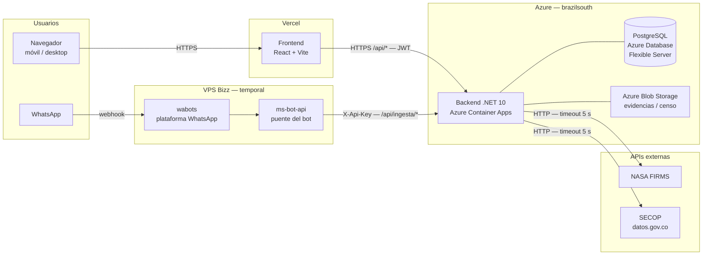

# Arquitectura — ConectaRiesgoAI

> Este documento define **dónde va cada cosa**. Si tienes que decidir en qué carpeta poner un archivo y dudas, la respuesta está aquí. Si no está, avisa en el grupo y lo agregamos.
>
> El **qué** manda cada endpoint está en [CONTRATO-API.md](CONTRATO-API.md). Este documento es el **dónde**.

## Decisiones tomadas

| Área | Decisión |
|:---|:---|
| Repositorio | Monorepo: backend y frontend conviven en el mismo repo |
| Backend | .NET 10, Web API, **arquitectura de slice vertical** con MediatR |
| Base de datos | PostgreSQL + EF Core |
| Frontend | React 18 + Vite + TypeScript, organizado por features |
| Puerto backend | `http://localhost:5000` (según el contrato de API) |
| Puerto frontend | `http://localhost:5173` (Vite por defecto) |

---

## Diagrama de despliegue



> El bloque «VPS Bizz» es temporal: cuando el backend quede verificado en Azure, `ms-bot-api` se apaga y `wabots` apuntará directo al backend. Ver [INTEGRACION-BOT-BACKEND.md](INTEGRACION-BOT-BACKEND.md).

---

## Estructura general

```
app-ungrd/
├─ back/     API en .NET 10
├─ front/    Aplicación React
└─ docs/     Documentación del proyecto
```

---

## Backend — slice vertical

La idea es simple: **cada endpoint vive en su propia carpeta, con todo lo que necesita adentro.** No hay capas Application/Domain/Infrastructure repartidas por todo el repo. Si trabajas en "crear reporte", abres una sola carpeta y ahí está todo.

```
back/
├─ src/
│  └─ ConectaRiesgoAI.Api/
│     ├─ Features/                      ← el corazón: una carpeta por endpoint
│     │  ├─ Auth/
│     │  │  ├─ Registro/
│     │  │  ├─ Login/
│     │  │  └─ ObtenerPerfil/
│     │  ├─ Reportes/
│     │  │  ├─ CrearReporte/
│     │  │  ├─ ListarReportes/
│     │  │  ├─ ObtenerReporte/
│     │  │  ├─ MisReportes/
│     │  │  └─ ActualizarEstado/
│     │  ├─ Estadisticas/
│     │  │  └─ ResumenEstadisticas/
│     │  ├─ Verificacion/
│     │  │  └─ VerificacionSatelital/
│     │  ├─ Transparencia/
│     │  │  └─ ContratosSecop/
│     │  ├─ Evidencias/
│     │  │  └─ SubirEvidencia/
│     │  └─ Ingesta/                     ← bot de WhatsApp / Dapta, autenticado con X-Api-Key
│     │     ├─ CrearReporte/
│     │     ├─ ObtenerReporte/
│     │     └─ RegistrarCenso/
│     │
│     ├─ Domain/                        ← modelo compartido entre slices
│     │  ├─ Entities/                     Usuario, Reporte, EventoCronologia
│     │  ├─ Enums/                        Rol, Tipo, Estado, Prioridad
│     │  └─ ValueObjects/                 Ubicacion
│     │
│     ├─ Persistence/
│     │  ├─ Configurations/               IEntityTypeConfiguration<T>
│     │  └─ Migrations/                   generadas por dotnet ef
│     │
│     ├─ Common/                         ← lo transversal
│     │  ├─ Behaviors/                    pipeline de MediatR (validación)
│     │  ├─ Endpoints/                    IEndpoint + registro automático
│     │  ├─ Errors/                       forma única de error del contrato
│     │  ├─ Auth/                         JWT, políticas por rol
│     │  └─ Extensions/
│     │
│     ├─ Integrations/                   ← clientes de APIs externas
│     │  ├─ Nasa/                          NASA FIRMS
│     │  ├─ Secop/                         datos.gov.co
│     │  └─ Storage/                       Azure Blob Storage (evidencias, censo)
│     │
│     └─ Properties/
│
└─ tests/
   └─ ConectaRiesgoAI.Api.Tests/
      └─ Features/
         ├─ Auth/
         └─ Reportes/
```

### Qué va dentro de un slice

Ejemplo con `Features/Reportes/CrearReporte/`. **Esta es la plantilla que se replica en todos los slices:**

| Archivo | Rol |
|:---|:---|
| `CrearReporteCommand.cs` | el request — `IRequest<CrearReporteResponse>` |
| `CrearReporteHandler.cs` | la lógica; habla directo con el `DbContext` |
| `CrearReporteValidator.cs` | FluentValidation; corre solo, en el pipeline |
| `CrearReporteEndpoint.cs` | el mapeo HTTP (ruta, verbo, rol requerido) |
| `CrearReporteResponse.cs` | el DTO de salida, con la forma exacta del contrato |

Las consultas usan `Query` en vez de `Command`: `ListarReportesQuery`, `ListarReportesHandler`, etc.

### Las dos reglas del slice

1. **Un slice nunca importa código de otro slice.** Si `ActualizarEstado` necesita algo que ya escribió `CrearReporte`, ese algo se sube a `Domain/`, `Common/` o `Persistence/`. Copiar tres líneas es mejor que acoplar dos slices.
2. **Lo que se repite en dos slices no se comparte todavía; en tres, sí.** Compartir demasiado temprano nos devuelve al enredo del que estamos huyendo.

### Dónde cae cada endpoint del contrato

| Endpoint | Slice |
|:---|:---|
| `POST /api/auth/registro` | `Features/Auth/Registro/` |
| `POST /api/auth/login` | `Features/Auth/Login/` |
| `GET /api/auth/yo` | `Features/Auth/ObtenerPerfil/` |
| `POST /api/reportes` | `Features/Reportes/CrearReporte/` |
| `GET /api/reportes` | `Features/Reportes/ListarReportes/` |
| `GET /api/reportes/{codigo}` | `Features/Reportes/ObtenerReporte/` |
| `GET /api/reportes/mios` | `Features/Reportes/MisReportes/` |
| `PATCH /api/reportes/{codigo}/estado` | `Features/Reportes/ActualizarEstado/` |
| `GET /api/estadisticas/resumen` | `Features/Estadisticas/ResumenEstadisticas/` |
| `GET /api/verificacion/satelital` | `Features/Verificacion/VerificacionSatelital/` |
| `GET /api/transparencia/secop` | `Features/Transparencia/ContratosSecop/` |
| `POST /api/evidencias` | `Features/Evidencias/SubirEvidencia/` |
| `POST /api/ingesta/reportes` | `Features/Ingesta/CrearReporte/` |
| `GET /api/ingesta/reportes/{codigo}` | `Features/Ingesta/ObtenerReporte/` |
| `POST /api/ingesta/censo` | `Features/Ingesta/RegistrarCenso/` |

> `GET /api/reportes/{codigo}` compone su respuesta llamando a `Integrations/Nasa` y `Integrations/Secop`. Ambas con tiempo límite de 5 segundos y devolviendo `null` / `[]` si fallan — la pantalla de seguimiento **nunca** se cae por un servicio externo.
>
> `POST /api/evidencias` sube un archivo a Azure Blob Storage vía `Integrations/Storage` y
> devuelve una URL firmada; nunca guarda nada en Postgres. Si Azure Blob Storage falla, responde
> `subida: false` y `urlFoto: null` en vez de un 500 — mismo trato que NASA/SECOP.
>
> `POST /api/ingesta/reportes` y `POST /api/ingesta/censo` no llevan sesión de usuario: se
> autentican con la cabecera `X-Api-Key` porque quien llama es un servicio (el bot de WhatsApp o el
> agente telefónico), no una persona con token. `GET /api/ingesta/reportes/{codigo}` es público y
> responde `200` siempre, incluso con código inexistente — el bot no distingue ramas de error.
> Detalle en [INTEGRACION-BOT-BACKEND.md](INTEGRACION-BOT-BACKEND.md).

---

## Frontend — por features (hoy) → por experiencia (destino)

La misma idea del backend: agrupar por lo que hace, no por lo que es. **Este documento describe
dónde va cada archivo hoy.** El destino — reorganizar por experiencia de usuario (Terreno vs. Sala
de crisis) en vez de por feature — ya está diseñado y en construcción, con su propio documento:
[EXPERIENCIAS-FRONTEND.md](EXPERIENCIAS-FRONTEND.md). Léelo antes de crear una pantalla nueva o de
mover archivos: define a qué experiencia pertenece cada rol y el plan de migración por pasos.

```
front/
├─ public/
└─ src/
   ├─ api/               cliente HTTP (src/api/client.ts) + una función por endpoint
   ├─ mocks/             respuestas de ejemplo del CONTRATO-API
   ├─ features/
   │  ├─ auth/           login, registro, sesión
   │  ├─ reportes/       dashboard, reportar, seguimiento
   │  ├─ publico/        landing pública
   │  ├─ gestor/         panel de la autoridad (incluye el mapa de observación)
   │  ├─ rescatista/     tablero y flujo del brigadista (censo)
   │  ├─ socorro/        bitácora de incidente y evaluación de habitabilidad
   │  └─ ungrd/          panel UNGRD: lista de desastres y paquete del ministerio (Fase 3.5)
   ├─ components/        UI compartida (layout, badges, botones, mapa)
   ├─ hooks/             hooks transversales
   ├─ lib/               utilidades (incluye almacenamiento en localStorage, en transición)
   ├─ types/             tipos espejo de los DTOs del backend
   └─ styles/
```

> No hay features separadas `mapa/` ni `admin/`: el mapa vive como componente compartido
> (`components/ui/MapaUbicacion.tsx`, `features/gestor/components/MapaObservacion.tsx`) y lo que
> iba a ser "admin" es `features/ungrd/`, mucho más grande que un panel de administración genérico —
> es la implementación de la Fase 3.5 (`docs/REPARTO-SECTORIAL.md`).

Cada feature tiene adentro `components/`, `hooks/` y `pages/`. Lo que usen dos features distintas sube a `src/components/` o `src/hooks/`.

### Dónde cae cada pantalla

| Pantalla | Ubicación |
|:---|:---|
| Login / Registro | `features/auth/pages/` |
| Dashboard ciudadano | `features/reportes/pages/` |
| Reportar emergencia | `features/reportes/pages/` |
| Seguimiento del reporte | `features/reportes/pages/` |
| Mapa de riesgo | `components/ui/MapaUbicacion.tsx` |
| Panel de gestor | `features/gestor/pages/` |
| Censo de damnificados (brigadista) | `features/rescatista/pages/` |
| Bitácora de incidente / habitabilidad (socorro) | `features/socorro/pages/` |
| Panel UNGRD — lista de desastres, paquete del ministerio | `features/ungrd/pages/` |

### `src/api/client.ts` existe, pero `reportes.ts` todavía no lo usa

Hay un cliente HTTP real y completo (`apiFetch<T>()`, timeout de 15 s, `ErrorApi` con mensajes en
español). El bloqueante B2 de `CONTROL.md` no es que falte ese cliente: es que
`features/reportes/` sigue leyendo de `mocks/` y `lib/almacenamiento` (localStorage) por diseño de
transición, tal como lo explica el propio comentario del archivo. Conectar `reportes.ts` al cliente
real es lo que cierra B2.

### `src/mocks/` no es opcional

Ahí van los ejemplos de respuesta del contrato, copiados tal cual. El frontend construye contra ellos desde el minuto cero y cuando un endpoint queda listo solo se cambia el origen de datos en `src/api/`. **Nadie espera a nadie.**

---

## Cómo correr el proyecto

Requisitos: **.NET 10 SDK**, **Node 20+**, **Docker** (para PostgreSQL).

```bash
# 1. Configuración local (solo la primera vez)
cp back/src/ConectaRiesgoAI.Api/appsettings.Development.example.json \
   back/src/ConectaRiesgoAI.Api/appsettings.Development.json

# 2. Base de datos
docker compose up -d

# 3. Aplicar las migraciones (solo la primera vez y cuando alguien agregue una)
dotnet ef database update --project back/src/ConectaRiesgoAI.Api

# 4. Backend  → http://localhost:5000, Swagger en /swagger
dotnet run --project back/src/ConectaRiesgoAI.Api

# 5. Frontend → http://localhost:5173
npm install --prefix front
npm run dev --prefix front
```

Para comprobar que la API está viva sin depender de la base de datos: `GET http://localhost:5000/health`
(también responde en `/api/health`, para quien prefiera mantener todo bajo el prefijo del contrato).

Si cambias una entidad, genera la migración:

```bash
dotnet ef migrations add NombreDelCambio \
  --project back/src/ConectaRiesgoAI.Api \
  --output-dir Persistence/Migrations
```

## Variables de entorno

| Variable | Dónde | Para qué |
|:---|:---|:---|
| `ConnectionStrings__Postgres` | backend | conexión a PostgreSQL |
| `Jwt__Secret` | backend | firma de los tokens |
| `Nasa__ApiKey` | backend | NASA FIRMS |
| `Secop__AppToken` | backend | datos.gov.co (opcional, sube el límite de consultas) |
| `VITE_API_BASE_URL` | frontend | `http://localhost:5000/api` |

En el backend estas llaves viven en `appsettings.json` (vacías, es la plantilla) y se llenan en
`appsettings.Development.json` para local — copiado de
[`appsettings.Development.example.json`](../back/src/ConectaRiesgoAI.Api/appsettings.Development.example.json),
que ya es JSON estrictamente válido (sin comentarios: ASP.NET Core sí tolera `//`/`/* */` vía
`JsonCommentHandling.Skip`, verificado en vivo — se quitaron por portabilidad con herramientas que
sí son estrictas, como `jq`, linters y editores) y trae valores de desarrollo que sirven tal cual:
la cadena de conexión que corresponde al `docker-compose.yml` y un secreto JWT de juguete.

En el frontend, `VITE_API_BASE_URL` va en `.env.local` (no se commitea), copiado de
[`front/.env.example`](../front/.env.example).

**Nada de eso sirve fuera de local.** En despliegue se pasan como variables de entorno con doble guion
bajo (`ConnectionStrings__Postgres`, `Jwt__Secret`), que sobrescriben lo del archivo.

### PostgreSQL: Docker local para desarrollar, Azure en producción (issue #4 y #19)

**Decisión (D15 en `CONTROL.md`):** el backend desplegado usa **Azure Database for PostgreSQL
Flexible Server** (región `brazilsouth`), no Neon/Supabase/Railway como se barajó antes. Docker
local (`docker-compose.yml`) sigue siendo el arranque de un solo comando para desarrollar: ambos
usan la misma clave `ConnectionStrings:Postgres`, así que apuntar el entorno local a la base
compartida de Azure en vez de a Docker es solo reemplazar ese valor en tu
`appsettings.Development.json` — la cadena real se comparte por el grupo privado, **nunca en un
commit**. Ver [`README.md`](../README.md#ambientes) para la URL del backend en producción.

---

## Pendientes de este documento

- **Nombre del producto (cerrado):** la app se llama **ConectaRiesgo** (UI y documentación). Los namespaces del backend usan `ConectaRiesgoAI`. `RespondeYA` quedó solo en documentos históricos de exploración (`docs/idea-negocio/`).
- **`servicios/` vs `Integrations/` (resuelto):** `back/src/ConectaRiesgoAI.Api/Integrations/`
  **es el único camino vigente** — `Integrations/Nasa`, `Integrations/Secop` e
  `Integrations/Storage` tienen código real y en uso, y `ObtenerReporteHandler` los consume para
  componer `GET /api/reportes/{codigo}`. Los antiguos `ms-satelital`, `ms-transparencia` y
  `ms-social` en `servicios/` nunca tuvieron código propio versionado (solo su
  `appsettings.Example.json`) y se dieron de baja del repositorio. `servicios/` hoy solo contiene
  `ms-bot-api`, que sí corre en producción como puente temporal del bot de WhatsApp — no compite
  con `Integrations/`, resuelve un problema distinto.
- Los enums de este documento siguen `CONTRATO-API.md` (`Incendio`, `Inundacion`, …), que difiere de las categorías de `idea-negocio/investigacion-uno.md` (`vivienda_albergue`, …). **Manda el contrato**, porque es lo que frontend y backend ya acordaron.
- Falta definir el despliegue (`docker-compose.yml` solo cubre la base de datos local). El backend en
  producción sí está definido — Azure Container Apps, ver más abajo.
