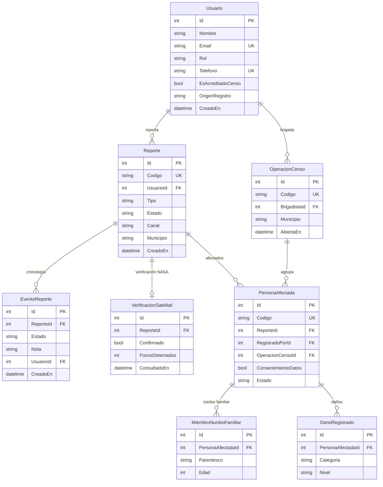
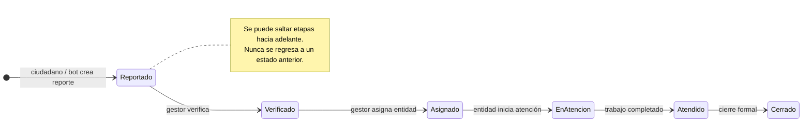

# Modelo de datos — ConectaRiesgo

> Todo lo que el sistema guarda. Es la referencia para el backend (.NET + EF Core) y para saber qué campos pedir en cada pantalla.
>
> **Regla:** si un campo no está aquí, no existe. Antes de agregar uno, se anota en este documento y se avisa al grupo — un campo nuevo que aparece solo en el código rompe el contrato con el frontend.

---

## Vista general

`PersonaAfectada.ReporteId` es opcional: puede colgar de un `Reporte` concreto o quedar suelta
dentro de la `OperacionCenso` que la agrupó.

Hay **dos niveles de captura** y conviene no confundirlos:

| Nivel | Quién lo hace | Qué captura | Cuándo |
|:---|:---|:---|:---|
| **Reporte rápido** | Ciudadano | Qué pasa, dónde, una foto | En el momento de la emergencia |
| **Registro de damnificado** | Brigadista certificado | Quién está afectado, cuánto perdió, con documentos | Después, en terreno |

El reporte rápido es la puerta de entrada. El registro de damnificado es el censo que viene detrás.

---

## 1. Usuario

Quien entra al sistema.

| Campo | Tipo | Obligatorio | Notas |
|:---|:---|:---:|:---|
| `Id` | int | ✅ | Clave primaria |
| `Nombre` | string(120) | ✅ | |
| `Email` | string(160) | ✅ | Único |
| `PasswordHash` | string | ✅ | BCrypt. **Nunca en texto plano** |
| `Rol` | enum | ✅ | Ver abajo |
| `Municipio` | string(80) | ❌ | Su zona por defecto |
| `Telefono` | string(20) | ❌ | Único. Es la identidad del usuario en WhatsApp |
| `CreadoEn` | datetime | ✅ | UTC |
| `EsAcreditadoCenso` | bool | ✅ | Si puede registrar damnificados. Por defecto `false`. **No se pregunta: se acredita** (art. 7, Res. 1110 de 2022) |
| `OrigenRegistro` | enum | ✅ | `Web` · `WhatsApp` · `Telefono`. Por defecto `Web` |

**Rol:** `Ciudadano` · `Gestor` · `Admin`

> **No existe un rol `Brigadista` en el enum.** Quien censa en terreno sigue siendo un `Usuario` con
> `Rol = Ciudadano` (o el que tenga) y `EsAcreditadoCenso = true` — la acreditación es el booleano,
> no un rol aparte. `docs/EXPERIENCIAS-FRONTEND.md` usa "Brigadista" y "Socorro" como nombres de
> **experiencia de UI**, no como valores de este enum; no los confundas al validar entrada en el
> backend.
>
> `CodigoBrigadista`, `EntidadId` y `Activo` **no existen todavía como campos de `Usuario`** en el
> código (`Domain/Entities/Usuario.cs`). Estaban en una versión anterior de este documento; si hacen
> falta, hay que agregarlos con su migración antes de documentarlos como reales.

---

## 2. Reporte

La emergencia. Es el centro del sistema.

| Campo | Tipo | Obligatorio | Notas |
|:---|:---|:---:|:---|
| `Id` | int | ✅ | |
| `Codigo` | string(24) | ✅ | Lo que ve el ciudadano: `RPT-2026-08-15-0047` |
| `UsuarioId` | int | ✅ | Quién lo reportó |
| `Tipo` | enum | ✅ | Ver abajo |
| `Descripcion` | string(1000) | ✅ | |
| `Latitud` | double? | ❌ | Nula cuando el reporte entra por WhatsApp: ahí solo hay `UbicacionTexto` |
| `Longitud` | double? | ❌ | Ídem |
| `Direccion` | string(200) | ❌ | Texto libre |
| `Departamento` | string(80) | ❌ | |
| `Municipio` | string(80) | ✅ | Se usa para consultar SECOP |
| `Comuna` | string(80) | ❌ | |
| `UbicacionTexto` | string(300) | ❌ | Ubicación en texto libre, tal como la escribe el ciudadano por WhatsApp |
| `Clase` | enum | ✅ | `AvisoEvento` · `AfectacionPropia`. Por defecto `AfectacionPropia` |
| `Confianza` | enum | ✅ | `Autorreportado` · `Verificado` · `Censado` · `Avalado`. Por defecto `Autorreportado` |
| `Canal` | enum | ✅ | `Web` · `WhatsApp` · `Telefono`. Por defecto `Web` |
| `IdentificadorCanal` | string(120) | ✅ | Quién reportó en ese canal: `usuario:{id}` en web, número E.164 en WhatsApp/teléfono. **No se expone en la API pública** |
| `ReferenciaExterna` | string(160) | ❌ | Id de la interacción externa (`wamid`, `call_id`). Nulo en web. Índice único parcial con `Canal` para idempotencia |
| `Estado` | enum | ✅ | Arranca en `Reportado` |
| `Prioridad` | enum | ✅ | `Baja` · `Media` · `Alta` |
| `PersonasAfectadas` | int | ❌ | Estimado rápido |
| `CreadoEn` | datetime | ✅ | UTC |
| `ActualizadoEn` | datetime | ✅ | UTC |
| `SincronizadoEn` | datetime? | ❌ | Cuándo subió, si se capturó sin señal |

**Tipo:** `Incendio` · `Inundacion` · `Deslizamiento` · `ViaAfectada` · `ColapsoEstructural` ·
`Sismo` · `Vendaval` · `AvenidaTorrencial` · `Otro`

> Los tres últimos se agregaron porque el agente telefónico los dicta y devolvían 500 (issue #71).
> `AvenidaTorrencial` va **sin espacio**: es una creciente súbita que arrastra lodo, distinta de una inundación lenta.

**Estado:** `Reportado` → `Verificado` → `Asignado` → `EnAtencion` → `Atendido` → `Cerrado`

> Se puede saltar hacia adelante, **nunca hacia atrás**. Sin tildes ni eñes en los valores de enum, para que viajen igual entre C# y JavaScript.

> **Clase** distingue un aviso sobre un evento de una afectación que el ciudadano vive en carne propia — mezclarlos produce datos inutilizables para la alcaldía. **Confianza** es el nivel de respaldo del dato: reportar no es lo mismo que ser censado (ver `docs/INTEGRACION-BOT-BACKEND.md`, sección 5).

---

## 3. EventoReporte — la cronología

Cada cambio de estado deja un registro. **De aquí sale la línea de tiempo que ve el ciudadano**, que es el diferenciador del producto.

| Campo | Tipo | Obligatorio |
|:---|:---|:---:|
| `Id` | int | ✅ |
| `ReporteId` | int | ✅ |
| `Estado` | enum | ✅ |
| `Nota` | string(500) | ❌ |
| `UsuarioId` | int? | ❌ | `null` si lo hizo el sistema |
| `CreadoEn` | datetime | ✅ |

---

## 4. PersonaAfectada — el registro de damnificado

Lo que captura el brigadista. **Contiene datos personales sensibles: leer la sección de privacidad al final antes de tocar esta tabla.**

### Identificación

| Campo | Tipo | Obligatorio | Notas |
|:---|:---|:---:|:---|
| `Id` | int | ✅ | |
| `Codigo` | string(24) | ✅ | `DMN-2026-08-15-0031` |
| `ReporteId` | int? | ❌ | A qué emergencia pertenece |
| `RegistradoPorId` | int | ✅ | El brigadista |
| `Nombres` | string(120) | ✅ | |
| `Apellidos` | string(120) | ✅ | |
| `TipoDocumento` | enum | ✅ | `CC` · `TI` · `CE` · `Pasaporte` · `RC` · `SinDocumento` |
| `NumeroDocumento` | string(30) | ❌ | Opcional: en una emergencia se pierden los documentos |
| `Edad` | int | ✅ | |
| `Genero` | enum | ✅ | `Femenino` · `Masculino` · `Otro` · `PrefiereNoDecir` |
| `Telefono` | string(20) | ❌ | |
| `TelefonoAlterno` | string(20) | ❌ | Un vecino o familiar |
| `Email` | string(160) | ❌ | |

> **`SinDocumento` no es un detalle menor.** Una persona que perdió la cédula en la inundación es exactamente quien más necesita la ayuda. Si el formulario exige documento, el sistema deja por fuera a los más afectados.

### Ubicación

| Campo | Tipo | Obligatorio |
|:---|:---|:---:|
| `Departamento` | string(80) | ✅ |
| `Ciudad` | string(80) | ✅ |
| `Comuna` | string(80) | ❌ |
| `DireccionResidencia` | string(200) | ✅ |
| `Latitud` / `Longitud` | double? | ❌ | GPS del punto de registro |
| `EsResidenteDelMunicipio` | bool | ✅ | Distingue damnificado local de población flotante |

### Condiciones de vulnerabilidad

No estaban en el boceto original y **son de las más importantes**: definen a quién se atiende primero.

| Campo | Tipo | Notas |
|:---|:---|:---|
| `EsCabezaDeHogar` | bool | |
| `TieneDiscapacidad` | bool | |
| `EsAdultoMayor` | bool | 60 años o más |
| `EstaEmbarazada` | bool | |
| `PerteneceGrupoEtnico` | enum? | `Indigena` · `Afrocolombiano` · `Rrom` · `Raizal` · `Palenquero` · `Ninguno` |
| `EsVictimaConflicto` | bool | |
| `RequiereAtencionMedica` | bool | |
| `ObservacionesSalud` | string(500) | Dato sensible: solo lo indispensable |

### Cierre del registro

| Campo | Tipo | Notas |
|:---|:---|:---|
| `DeclaracionVeracidad` | bool | La persona declara que la información es cierta |
| `FechaDeclaracion` | datetime? | |
| `ConsentimientoDatos` | bool | **Obligatorio por Ley 1581.** Autoriza el tratamiento de sus datos |
| `Estado` | enum | `Borrador` · `Completo` · `Verificado` · `Rechazado` |
| `CreadoEn` / `SincronizadoEn` | datetime | Se separan para saber si se capturó sin señal |

---

## 5. MiembroNucleoFamiliar

Cada persona que depende del damnificado principal.

| Campo | Tipo | Obligatorio |
|:---|:---|:---:|
| `Id` | int | ✅ |
| `PersonaAfectadaId` | int | ✅ |
| `Nombres` / `Apellidos` | string(120) | ✅ |
| `Parentesco` | enum | ✅ | `Conyuge` · `Hijo` · `Padre` · `Hermano` · `Abuelo` · `Otro` |
| `Edad` | int | ✅ |
| `TipoDocumento` / `NumeroDocumento` | | ❌ |
| `TieneDiscapacidad` | bool | ✅ |
| `EstudiaActualmente` | bool | ❌ | Sirve para gestionar cupos escolares |

> **Cuidado con los menores de edad.** Sus datos tienen protección reforzada bajo la Ley 1581. En la demo, usar siempre datos inventados.

---

## 6. DanoRegistrado

Qué perdió la persona. Un registro por categoría afectada.

| Campo | Tipo | Obligatorio | Notas |
|:---|:---|:---:|:---|
| `Id` | int | ✅ | |
| `PersonaAfectadaId` | int | ✅ | |
| `Categoria` | enum | ✅ | Ver abajo |
| `Nivel` | enum | ✅ | `Leve` · `Moderado` · `Grave` · `DestruccionTotal` |
| `TipoInmueble` | enum? | ❌ | Solo si `Categoria = Vivienda` |
| `EsPropietario` | bool? | ❌ | Propietario o arrendatario |
| `Descripcion` | string(1000) | ❌ | |
| `ValorEstimado` | decimal? | ❌ | En pesos, si se puede estimar |
| `HectareasAfectadas` | decimal? | ❌ | Solo agricultura |
| `AnimalesPerdidos` | int? | ❌ | Solo agricultura |

**Categoria:** `Vivienda` · `Salud` · `Agricultura` · `Vial` · `Educacion` · `MediosDeVida` · `ServiciosPublicos`

**Nivel:** `Leve` (puede habitarse) · `Moderado` (requiere reparaciones) · `Grave` (inhabitable) · `DestruccionTotal`

**TipoInmueble:** `Casa` · `Apartamento` · `Rancho` · `Local` · `Finca` · `Otro`

> `Educacion`, `MediosDeVida` y `ServiciosPublicos` son categorías agregadas al boceto original. Perder las herramientas de trabajo o quedarse sin agua potable son afectaciones reales que el boceto no contemplaba.

---

## 7. Evidencia

Todas las fotos, de reportes y de registros.

| Campo | Tipo | Obligatorio | Notas |
|:---|:---|:---:|:---|
| `Id` | int | ✅ | |
| `ReporteId` | int? | ❌ | Uno de los dos debe venir |
| `PersonaAfectadaId` | int? | ❌ | |
| `Tipo` | enum | ✅ | Ver abajo |
| `Url` | string(500) | ✅ | Cloudinary |
| `NombreArchivo` | string(200) | ❌ | |
| `TamanoBytes` | long | ❌ | Máximo 5 MB |
| `Latitud` / `Longitud` | double? | ❌ | Dónde se tomó |
| `CapturadaEn` | datetime? | ❌ | |
| `SubidaEn` | datetime | ✅ | |

**Tipo:** `DanoMaterial` · `DocumentoFrontal` · `DocumentoPosterior` · `Rostro` · `NucleoFamiliar` · `Otro`

> ⚠️ `DocumentoFrontal`, `DocumentoPosterior` y `Rostro` son **datos biométricos y de identificación**. Ver privacidad abajo.
>
> ⚠️ **Esta tabla describe la forma del dato, pero `Evidencia` no existe como entidad persistida
> en `back/src/ConectaRiesgoAI.Api/Domain/Entities/`.** `POST /api/evidencias` (`Integrations/Storage`)
> solo sube el archivo a Azure Blob Storage y devuelve una URL firmada — no crea ninguna fila. Quien
> llama guarda esa URL donde le corresponda (`Reporte.UrlFoto` vía el flujo de Cloudinary, o el campo
> equivalente al crear una `PersonaAfectada`). Si se decide persistir metadatos de evidencia (quién
> subió qué, cuándo), hace falta crear la entidad y su migración antes de tratarla como real.

---

## 8. VerificacionSatelital

Resultado de consultar NASA FIRMS. Lo llena el cliente HTTP interno `Integrations/Nasa`.

| Campo | Tipo | Notas |
|:---|:---|:---|
| `Id` | int | |
| `ReporteId` | int | |
| `Fuente` | string(60) | `NASA FIRMS` |
| `Confirmado` | bool | |
| `FocosDetectados` | int | |
| `DistanciaMasCercanaKm` | double? | |
| `Detalle` | string(300) | Texto listo para mostrar |
| `ConsultadoEn` | datetime | |

> **Solo aplica a incendios.** FIRMS detecta calor: en inundaciones y deslizamientos siempre vendrá vacío, y está bien. Decirlo en el pitch suma credibilidad.

---

## 9. Entidad

Alcaldías y organismos que atienden.

| Campo | Tipo |
|:---|:---|
| `Id` | int |
| `Nombre` | string(160) |
| `Tipo` | enum — `Alcaldia` · `Gobernacion` · `UNGRD` · `DefensaCivil` · `Bomberos` · `CruzRoja` · `Otra` |
| `Municipio` / `Departamento` | string(80) |
| `Telefono` / `Email` | string |

---

## 10. OperacionCenso

Jornada de censo de un brigadista: agrupa las `PersonaAfectada` que registra un mismo brigadista
en un mismo municipio. No estaba en el diseño original — se agregó con el issue #48 para completar
la jerarquía del RUD sobre las tablas de censo que ya existían, sin duplicar ningún modelo.

| Campo | Tipo | Obligatorio | Notas |
|:---|:---|:---:|:---|
| `Id` | int | ✅ | |
| `Codigo` | string(30) | ✅ | `CEN-2026-08-16-0001-K7M2`. El sufijo de 4 caracteres es aleatorio, no adivinable |
| `Municipio` | string(80) | ✅ | |
| `BarrioVereda` | string(80) | ❌ | |
| `BrigadistaId` | int | ✅ | Debe tener `Usuario.EsAcreditadoCenso = true` |
| `AbiertaEn` | datetime | ✅ | UTC |
| `CerradaEn` | datetime? | ❌ | El campo existe pero **ningún caso de uso lo asigna todavía** — el issue #48 solo cubre abrir o reutilizar la jornada, no cerrarla |

> Al recibir un registro de censo por WhatsApp (`POST /api/ingesta/censo`), el backend reutiliza la
> `OperacionCenso` abierta del brigadista en ese municipio o abre una nueva. Como `CerradaEn` nunca
> se asigna, hoy un brigadista que vuelve a censar en el mismo municipio días después cae en la
> misma operación — el corte "por jornada" es la intención del modelo, no algo que el código
> garantice aún.

---

## Privacidad — léase antes de tocar los datos personales

Este sistema captura **cédulas por ambas caras, fotos de rostro, datos de salud y datos de menores**. En Colombia eso cae bajo la **Ley 1581 de 2012** y son datos sensibles y de menores, las dos categorías con protección más alta.

**Reglas que no se negocian:**

1. **El repositorio es público.** Nunca subir una foto de un documento real, ni siquiera "de prueba". Queda expuesta y sigue siendo recuperable del historial de Git aunque después se borre.
2. **Toda la demo con datos inventados.** Nombres, cédulas y rostros falsos, siempre.
3. **`ConsentimientoDatos` es obligatorio.** No se guarda una `PersonaAfectada` sin ese campo en `true`. No es burocracia: es lo que hace legal el registro.
4. **Solo el brigadista que registró y los gestores** de la entidad correspondiente pueden ver los datos completos. Un ciudadano nunca ve los datos de otro.
5. **Las fotos de documentos no se muestran en listados.** Solo en el detalle, y solo a quien tiene permiso.

**Y para el pitch:** si el jurado pregunta por tratamiento de datos personales, tener esta respuesta lista los deja muy por encima del resto. La mayoría de equipos no va a haberlo pensado.

---

## Qué se construye ahora y qué no

| Entidad | ¿Entra en el hackathon? |
|:---|:---|
| `Usuario`, `Reporte`, `EventoReporte` | ✅ Sí — es el núcleo de la demo |
| `Evidencia` | ⚠️ Solo como flujo de subida (`POST /api/evidencias` → URL firmada). No es una tabla propia — ver la nota en `7. Evidencia` |
| `VerificacionSatelital` | ✅ Sí — ya está el microservicio |
| `PersonaAfectada`, `MiembroNucleoFamiliar`, `DanoRegistrado`, `OperacionCenso` | ✅ Ya construidas — ver `10. OperacionCenso` abajo. Lo que falta no es el modelo, es conectar `features/rescatista/` del frontend al endpoint real |
| `Entidad` | ❌ No — se puede dejar como texto en `Municipio` |

**Regla de oro para no perder la demo:** si a la hora 16 el registro de damnificado no está terminado, se corta y se presenta el reporte ciudadano funcionando de punta a punta. **Una cosa completa vale más que dos a medias.**
