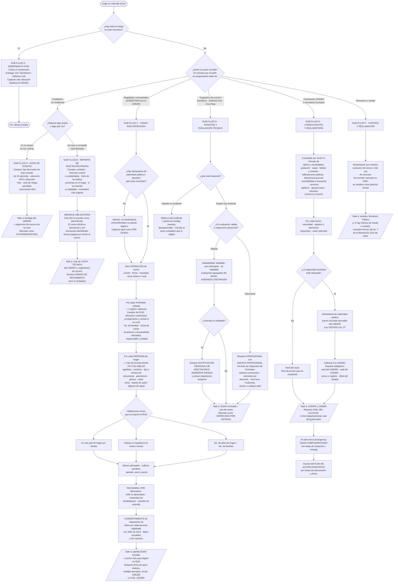

# Cómo funciona hoy el reporte de emergencias y la evaluación de daños en Colombia

**Documento de investigación para el diseño de sub-flujos de un chatbot de WhatsApp de gestión de desastres.**
Fecha de elaboración: 15 de agosto de 2026.

> **Cómo leer este documento.** Todo lo que aparece sin marca fue verificado en una fuente
> primaria (norma, formato oficial descargado, manual o guía de la UNGRD) citada en la sección 9.
> Lo que no pude verificar aparece marcado como **[INFERENCIA]** o **[NO VERIFICADO]**.
> Las contradicciones entre fuentes están señaladas explícitamente como **[CONTRADICCIÓN]**.

---

## 1. Resumen ejecutivo

En Colombia el reporte de una emergencia y el registro de un damnificado son **dos cosas
distintas, con actores, formatos y valor jurídico distintos**. Cualquiera puede *avisar* de un
evento; casi nadie puede *censar* a un damnificado. La Ley 1523 de 2012 pone al alcalde como
responsable directo del manejo de desastres en su municipio, y la información sube en cadena
CMGRD → CDGRD → UNGRD, con firma del alcalde o del gobernador como requisito de validez. El
instrumento técnico es el **EDAN** (Evaluación de Daños y Análisis de Necesidades), del que existen
formatos oficiales publicados y descargables (FR-1703-SMD-08 y FR-1703-SMD-09); el instrumento
censal es el **RUD** (Registro Único de Damnificados, Resolución 1256 de 2013), una aplicación web
con usuario y contraseña que la UNGRD entrega solo a alcaldías y gobernaciones, y sobre la que en
2022 se abrió el **RUNDA** (Resolución 1110 de 2022). El **autorreporte ciudadano no produce
condición de damnificado**: durante el terremoto de agosto de 2026 la Alcaldía de Cali fue
explícita en que el censo es presencial, casa por casa y en formato físico, mientras que el simple
*reporte de daños* sí se recibe por WhatsApp. Esa frontera —avisar vs. censar— es la que debe
gobernar los sub-flujos del bot.

---

## 2. Los actores y qué reporta cada uno

| Actor | Qué reporta | Con qué formato / instrumento | Ante quién | Nivel de detalle | Valor del reporte |
|---|---|---|---|---|---|
| **Ciudadano afectado** (reporta su propia casa/familia) | Afectación propia: daños en la vivienda, personas del hogar, necesidades | **No tiene formato oficial propio.** En la práctica: llamada, punto de atención presencial, o canal municipal ad-hoc (p. ej. WhatsApp de la alcaldía) | Organismo de socorro, alcaldía, CMGRD | Bajo/medio: descripción libre + fotos + dirección | **Insumo, no registro.** Detona una visita técnica; no crea condición de damnificado |
| **Ciudadano testigo** (no es víctima) | Ocurrencia de un evento: deslizamiento, inundación, incendio, colapso | Llamada a línea de emergencia; históricamente la app **"Yo Reporto"** de la UNGRD | Bomberos, Defensa Civil, Cruz Roja, Policía, CMGRD | Muy bajo: tipo de evento, ubicación, nivel de riesgo percibido, foto opcional | Alerta temprana / notificación. No entra a EDAN ni a RUD |
| **Brigadista o encuestador del censo** (personal organizado por el CMGRD con entidades operativas) | Censo por unidad familiar: cada persona del hogar, estado de la vivienda, necesidades | **Formato EDAN FR-1703-SMD-08** (planilla por persona) y digitación en la plataforma **RUD** | CMGRD → CDGRD → UNGRD | Alto: datos de identidad, salud, tenencia y estado del inmueble, ayudas requeridas | **Registro oficial.** Es lo que habilita ayuda humanitaria y programas |
| **Organismo de socorro** (bomberos, Defensa Civil, Cruz Roja) | Atención del incidente, evaluación técnica preliminar de daños, apoyo al censo | Informes propios de la entidad + participación como entidad operativa en el censo y en la entrega de AHE | CMGRD (son miembros del consejo territorial, art. 28 Ley 1523) | Alto en lo técnico-operativo | Oficial dentro de su competencia. Su concepto de habitabilidad detona la ruta del damnificado |
| **Funcionario del CMGRD / secretaría municipal** | Consolidado municipal de daños y necesidades; acta del consejo; declaratoria de calamidad | **Formato EDAN municipal** (consolidación de daños y necesidades); acta CMGRD; **formato PAE**; carga de PDF de soporte al RUD | CDGRD y UNGRD, con **aval del alcalde** | Muy alto: sectorial y agregado | Oficial. Es el documento que la UNGRD analiza para asignar recursos |
| **Coordinador / funcionario del CDGRD** | Consolidado departamental por municipios | **FR-1703-SMD-09 / FR-1900-SMD-04**, "Formato para consolidar la información sobre daños y necesidades", instrumento del CDGRD | Grupo de Evaluación de Daños de la UNGRD, con **aval del gobernador** | Muy alto | Oficial |
| **Profesional evaluador de vivienda** (ingeniero/arquitecto con tarjeta profesional) | Nivel de daño estructural de una vivienda y materiales requeridos | **Formato de Inspección de Viviendas Afectadas** (banco de materiales) y **Notificación Personal de Afectación e Inminente Riesgo** | Consejo territorial que ordena la inspección | Muy alto y técnico | Oficial. Habilita banco de materiales, evacuación y subsidio |
| **Personero municipal / veedor ciudadano** | Quejas, omisiones, exclusión indebida del censo, uso de recursos | **[NO VERIFICADO]** No encontré un canal ni formato de reporte propio dentro de la normativa de gestión del riesgo. Actúan por vías generales: derecho de petición, Ministerio Público, veedurías (Ley 850 de 2003) | Alcaldía, órganos de control | Variable | Control, no registro operativo |

---

## 3. Cómo funciona la cadena de reporte hoy, paso a paso

### 3.1 Marco de competencias (Ley 1523 de 2012, verificado)

- **Art. 12 y 14.** Gobernadores y alcaldes son conductores del sistema nacional en su nivel
  territorial. *"El alcalde… es el responsable directo de la implementación de los procesos de
  gestión del riesgo en el distrito o municipio, incluyendo… el manejo de desastres en el área de
  su jurisdicción."*
- **Art. 27 y 28.** Se crean los **Consejos departamentales, distritales y municipales de Gestión
  del Riesgo de Desastres**. Los preside el gobernador o alcalde e **incluyen por ley** al director
  de la Defensa Civil, al de la Cruz Roja Colombiana y al comandante de bomberos de la jurisdicción,
  además del comandante de Policía. Es decir: **los organismos de socorro no son externos al
  consejo, son parte de él.**
- **Art. 45.** La UNGRD debe poner en marcha el **Sistema Nacional de Información para la Gestión
  del Riesgo de Desastres**, alimentado por entidades nacionales y territoriales.
- **Art. 46** (modificado por Ley 2474 de 2025). Las autoridades departamentales, distritales y
  municipales **crearán sistemas de información propios** garantizando **interoperabilidad** con el
  sistema nacional y observando estándares de la UNGRD. → Esto es la puerta jurídica para que una
  herramienta territorial (o un bot municipal) se integre legalmente.

### 3.2 La secuencia operativa real

```
0.  Ocurre el evento.
1.  Aviso: comunidad / testigo / afectado avisa a un organismo de socorro,
    a la Policía o directamente al CMGRD.
2.  Respuesta inmediata: organismos de socorro atienden. Se activa el CMGRD
    (y la sala de crisis si aplica).
3.  Primeras 72 horas — dos tareas paralelas y distintas:
       a) EDAN: evaluación preliminar de daños y necesidades (CMGRD).
       b) CENSO por unidad familiar, que se envía a la UNGRD.
4.  Consolidación municipal: el CMGRD diligencia el formato de consolidación
    de daños y necesidades; el ALCALDE avala su envío.
5.  Escalamiento: CMGRD → CDGRD → UNGRD. Excepcionalmente CMGRD → UNGRD,
    siempre que el CDGRD esté informado.
6.  Solicitud de ayuda a la UNGRD. Documentos requeridos:
       - Acta del CMGRD
       - Aval del CDGRD
       - Censo o Registro
       - Oficio del alcalde concretando la solicitud
7.  Análisis y aprobación por la UNGRD → apoyo en especie o recursos económicos.
8.  Entrega y legalización: "Formato de Entrega de Asistencia Humanitaria de
    Emergencia - AHE", con firma y huella del jefe de hogar, Vo.Bo. del CMGRD,
    firma del presidente del CMGRD y Vo.Bo. del CDGRD.
       -> Regla del formato: "CADA FILA DEBE CORRESPONDER AL EDAN REALIZADO
          AL NÚCLEO FAMILIAR MEDIANTE EL NÚMERO DE FOLIO".
9.  Declaratoria (si procede): calamidad pública municipal/departamental o
    situación de desastre.
10. Al finalizar el periodo de emergencia se envía el EDAN COMPLEMENTARIO con
    la documentación completa (actas de recepción y entrega de ayuda).
11. Recuperación: Plan de Acción Específico (PAE), construido sobre el EDAN.
```

**Plazos verificados**

| Hito | Plazo | Fuente |
|---|---|---|
| EDAN + censo por unidad familiar | Primeras 72 horas (lista de chequeo) | Manual de Estandarización AHE, UNGRD |
| Actualización de datos en sala de crisis | Primeras 72 h: cada 6 h · 72 h–3 días: cada 8 h · día 3–5: cada 12 h · día 5+: cada 24 h | Guía Estrategia de Respuesta Municipal, UNGRD |
| Declaratoria de situación de desastre | Hasta **2 meses** después de ocurridos los hechos | Ley 1523/2012, art. 56 par. 1 |
| Retorno a la normalidad | Máx. **6 meses** (calamidad pública) y **12 meses** (desastre), prorrogables una vez por igual término | Ley 1523/2012, art. 64 par. |
| Respuesta a derecho de petición del damnificado | 15 días hábiles | Prensa (Infobae, ago. 2026) — plazo general del CPACA |
| Duración típica del subsidio de arriendo | Generalmente 3 meses | Preguntas frecuentes UNGRD |
| Elaboración del PAE | **[NO VERIFICADO]** La Ley 1523 no fija plazo en el art. 61. Cada decreto de declaratoria puede fijarlo | — |

### 3.3 Un matiz importante que suele perderse

La Guía de Estrategia de Respuesta Municipal dice literalmente que el levantamiento del censo/EDAN
*"se requiere en la menor brevedad, pero **no puede ser un obstáculo para brindar la ayuda
humanitaria**"*. Es decir: el sistema formalmente admite entregar ayuda antes de tener el censo
cerrado. En la práctica de campo, sin censo no hay entrega legalizable. **[INFERENCIA]** Esta
tensión entre "no bloquear la ayuda" y "no hay fila sin folio" es exactamente el hueco que un bot
bien diseñado puede cubrir: acelerar la captura, no sustituir la validación.

---

## 4. El formato EDAN en detalle

### 4.1 Qué es el EDAN y cuántos EDAN hay

El EDAN es la **Evaluación de Daños y Análisis de Necesidades**: identificar y registrar de forma
cuantitativa la extensión, gravedad y ubicación de los efectos de un evento adverso, para facilitar
la toma de decisiones. Metodológicamente viene del curso EDAN de USAID/OFDA, que la UNGRD ayudó a
actualizar en 2019 y cuyo público objetivo son funcionarios públicos locales/regionales/nacionales,
personal de ONG, bomberos y policías, e ingenieros y arquitectos.

**Tipos, según la fuente de OCHA Colombia (basada en material de la extinta DPAD, 2008):**

| Tipo | Cuándo | Para qué |
|---|---|---|
| **Evaluación inicial / preliminar** | Inmediata al evento, nivel local | Define si el alcance es local, regional o nacional |
| **Evaluación intermedia** | Días siguientes | Prioriza intervenciones; base del plan preliminar |
| **Evaluación complementaria** | Al cierre del periodo de emergencia | Información sectorial detallada; base del **Plan de Acción definitivo** |

También se clasifica por cobertura en **general** (valoración global) y **específica o sectorial**.

> **[CONTRADICCIÓN / desactualización]** La fuente de OCHA describe el flujo como
> *Comunidad → CLOPAD/CREPAD → Grupo EDAN (DPAD) → Sala de Crisis*. Esa nomenclatura fue derogada:
> la Ley 1523 de 2012 reemplazó CLOPAD por **CMGRD**, CREPAD por **CDGRD** y la DPAD por la
> **UNGRD**. La lógica del flujo se mantiene; los nombres no. La propia Guía del PAE de la UNGRD
> lo aclara: *"CDGRD: Consejo Departamental… (antiguo CREPAD). CMGRD: Consejo Municipal… (antiguo
> CLOPAD)"*.

La existencia del **"EDAN Complementario"** sí está confirmada en documentación vigente de la
UNGRD: el Manual de Estandarización de AHE ordena, en varios protocolos, *"Al finalizar el periodo
de emergencia se debe enviar el EDAN Complementario con la documentación completa (actas de
recepción y entrega de ayuda humanitaria, etc.)"*.

### 4.2 Formato EDAN nivel familia/persona — **FR-1703-SMD-08, versión 01**

Archivo oficial descargado del repositorio de la UNGRD (`VOL-3-Formato-EDAN.xlsx` /
`VOL-10-Formato-FR-1703-SMD-08.xlsx`, byte-idéntico). Encabezado literal del archivo:

- Proceso: **GESTIÓN MANEJO DE DESASTRES**
- Título: **EVALUACIÓN DE DAÑOS Y ANÁLISIS DE NECESIDADES (EDAN)**
- Código: **FR-1703-SMD-08** · Versión: 01

Es una **planilla de filas: una fila por persona**, agrupada por grupos de columnas:

| Bloque | Campos exactos |
|---|---|
| — | ITEM |
| **INFORMACIÓN DEMOGRÁFICA** | APELLIDOS · NOMBRES · TIPO DE DOCUMENTO · NÚMERO DE DOCUMENTO · PARENTESCO CON EL JEFE DE HOGAR · GÉNERO (F / M) · EDAD · ETNIA |
| **SALUD** | ESTADO DE SALUD · AFILIACIÓN AL RÉGIMEN DE SALUD |
| **VIVIENDA** | PROPIEDAD DEL INMUEBLE (PROPIA / ARRIENDO) · ESTADO DEL INMUEBLE · UBICACIÓN DEL INMUEBLE (URBANO / RURAL) |
| **NECESIDADES** | AHE ALIM. (SI/NO) · AHE NO ALIM. (SI/NO) · MAT. REHAB. DE VIVIENDA (SI/NO) · SUB. ARRIENDO (SI/NO) |
| **Cierre** | OBSERVACIONES · ELABORADO POR · ENTIDAD OPERATIVA · Vo.Bo. CMGRD · PRESIDENTE CMGRD · Vo.Bo. CDGRD |

Los campos de lista usan **códigos numéricos** (1–8 en parentesco, 1–6 en etnia, etc.) cuya leyenda
está en una imagen incrustada dentro del archivo Excel, no en texto. **[NO VERIFICADO]** No pude
extraer la tabla literal de códigos porque está embebida como imagen (`image1.emf` / `image2.png`).
Prefiero declararlo antes que inventar la correspondencia.

Observación de diseño relevante: **el formato exige tres firmas institucionales** (elaborador +
entidad operativa, Vo.Bo. CMGRD/presidente, Vo.Bo. CDGRD). Un registro sin esas firmas no es un
EDAN, es una lista.

### 4.3 Formato de consolidación de daños y necesidades — **FR-1703-SMD-09 / FR-1900-SMD-04, versión 01**

Archivo oficial descargado (`VOL-10-Formato-FR-1703-SMD-09.pdf`, 13 páginas). Título literal:
**"FORMATO PARA CONSOLIDAR LA INFORMACIÓN SOBRE DAÑOS Y NECESIDADES"**, proceso
**GESTIÓN MANEJO DE DESASTRES**, pie de página *"SNGRD - 2013"*.

Su primera hoja se titula **"FORMATO PARA INFORMACIÓN GENERAL (Instrumento para el CDGRD)"** y
establece de forma explícita el control de autoría y aprobación:

| Rol | Campo / titular |
|---|---|
| Quien diligencia | Nombre · Institución · Cargo · Teléfono fijo · Celular |
| Verifica la información | **Coordinador del CDGRD** |
| Aprueba el envío a la UNGRD (Grupo EDAN) | **Gobernador** |

Y la nota literal: *"El formato debe ser diligenciado por los integrantes del CDGRD, y avalado para
su envío al Grupo de Evaluación de Daños de la UNGRD por el Gobernador o en su defecto por el
Coordinador del Comité Regional."* La versión municipal es simétrica: la diligencian las
instituciones locales / el CMGRD y **el alcalde aprueba el envío**.

**Secciones del formato, en orden:**

1. **Datos generales** — quien diligencia, verifica y aprueba.
2. **Tipo de evento generador** — lista cerrada de 16 opciones: Sismo · Inundación · Deslizamiento ·
   Avalancha · Granizada · Tormenta Eléctrica · Tornado · Vendaval · Erupción Volcánica · Tsunami ·
   Incendio Forestal · Incendio Urbano · Incidente con Materiales Peligrosos · Explosión · Voladura
   de Poliducto · Atentado Terrorista.
3. **Descripción del evento inicial** — evento y su ubicación, magnitud, relación de municipios
   afectados. Fecha de la evaluación en formato Día/Mes/Año/Hora.
4. **Posibles eventos secundarios y/o riesgos asociados** — evento, municipios que lo reportan,
   riesgo asociado por municipio.
5. **Población afectada**, cantidad estimada por municipio: **Heridos · Muertos · Desaparecidos ·
   Familias afectadas · Personas afectadas**.
6. **Instalaciones de salud evaluadas** — por servicio, con nivel de afectación:
   *En servicio / Uso restringido / Fuera de servicio / Destruido / Averiado / Ubicado en zona de
   impacto / Sin acceso vehicular / Afectado por emergencia interna*. + Necesidades prioritarias.
7. **Aspectos Hábitat y Vivienda** — matriz por municipio de viviendas **URBANAS / RURALES /
   TOTAL**, cada una con **Averiadas** y **Destruidas**, con totales. Es decir, el sistema oficial
   maneja **dos categorías agregadas de daño de vivienda: averiada y destruida.**
8. **Edificaciones públicas afectadas** — Alcaldía · Establecimientos educativos · Instalaciones del
   ICBF · Instalaciones de cultura · Iglesias · Plaza de mercado · Escenarios deportivos · Otros;
   cada una calificada como *Averiado / Destruido / Uso restringido / Fuera de servicio*.
9. **Aspectos Telecomunicaciones** — Telefonía fija · Telefonía celular · Emisoras · Canales de TV ·
   Internet · Radiocomunicaciones · Enlace satelital · Radiocomunicaciones móviles · Comunicaciones
   aeronáuticas · Comunicaciones marítimas y fluviales · Computadores para Educar · Redes
   institucionales HF, VHF o UHF.
10. **Accesibilidad y transporte terrestre** — Red terciaria · Red secundaria · Red primaria ·
    Puentes vehiculares y/o pontones · Puentes peatonales · Túnel; con estado *Cerrada(o) / Con paso
    restringido* y comentario con abscisa de afectación (ej.: *"Pérdida de la banca en el km 23
    Soacha-Melgar"*).
11. **Otros modos de transporte** — Férreo · Marítimo · Fluvial · Aéreo · Terminal terrestre; y
    consolidado departamental de Puertos fluviales · Puerto marítimo · Aeropuertos · Terminales
    terrestres.
12. **Servicios públicos esenciales** — Acueducto · Alcantarillado · Saneamiento básico ·
    Recolección de basuras · Energía eléctrica · Gas. Por cada uno: *Averiado / Destruido / Uso
    restringido / Fuera de servicio*, **No. familias sin servicio**, **No. personas sin servicio**,
    descripción de la afectación y **perspectivas de recuperación**.
13. **Sector productivo agropecuario** — Agricultura · Ganadería · Piscícola · Porcícola · Avícola;
    con **hectáreas afectadas**, **No. productores afectados**, **pérdida de productos** y **pérdida
    de infraestructura**.
14. **Sector productivo: industria, comercio y turismo** — matriz de **No. de empresas afectadas**
    cruzando actividad económica (Financiero · Turístico · Comercial · Industrial · Minería ·
    Servicios) con tamaño (Microempresas · Pequeñas · Medianas · **Sector informal**).
15. En **cada** bloque sectorial se repite una tabla de cierre:
    **Necesidad | Equipos o elementos requeridos | Costo estimado**.

> **[CONTRADICCIÓN documental]** La *Guía Metodológica para la Elaboración del Plan de Acción
> Específico* (código G-1703-SMD-02, v.01, 06/06/2014) dice que el EDAN es el formato
> **FR-1703-SMD-05** y que el formato del PAE es el **FR-1703-SMD-09**. Pero el archivo que el
> propio repositorio de la UNGRD publica como `Formato-FR-1703-SMD-09` es el formato **EDAN de
> consolidación de daños y necesidades**, no el PAE. Hay una inconsistencia real en la codificación
> entre la guía y los archivos publicados. No la resolví; conviene no apoyarse en el código
> numérico como identificador estable.

### 4.4 Formatos hermanos del EDAN (todos verificados, descargados del repositorio UNGRD)

| Formato | Qué captura | Quién lo diligencia |
|---|---|---|
| **FR-1703-SMD-01 v.02 — "Formato de capacidades y necesidades del SNGRD"** | Inventario de talento humano, telecomunicaciones, equipos y herramientas, vehículos y transporte, elementos de ayuda humanitaria, agua y saneamiento, salud, alojamiento, por entidad (UNGRD, Bomberos, Defensa Civil, Cruz Roja, Ejército, Armada, Policía, Fuerza Aérea, Ministerio de Salud, maquinaria amarilla). Incluye la especialidad **EDAN** como capacidad de talento humano | Entidades del SNGRD |
| **"Formato de Inspección de Viviendas Afectadas"** | Información general, evento que afectó la vivienda, **sistema constructivo** (mampostería/madera), infraestructura actual (estructura, muros, pisos, cubierta con convenciones L/Bl/M/G/Ba, C/B/M/T, Pc/M/Ac/Tb/Z/P), **evaluación técnica por elemento** (vigas y columnas, muros de carga, muros divisorios, cubierta, entrepisos, placa de piso, instalaciones hidrosanitarias, instalaciones eléctricas) con nivel **Leve / Moderado / Severo / Colapso total**, requisitos del propietario, banco de materiales por combos y kits, esquema a mano alzada y registro fotográfico | **Profesional responsable con nombre, profesión y TARJETA PROFESIONAL**, aprobado por el coordinador del consejo territorial |
| **"Notificación Personal de Afectación e Inminente Riesgo — Vivienda No Habitable · Evacuación"** | Notificación formal al propietario de que su vivienda no es habitable y debe evacuar | Coordinador del CMGRD/CDGRD |
| **"Formato de Entrega de Asistencia Humanitaria de Emergencia - AHE"** | Familias beneficiadas (nombres, apellidos, documento), cantidades entregadas de kit alimentario, kit aseo, kit cocina, frazadas, toldillos, colchonetas, hamacas, tejas, caballetes, cemento, madera, tanques de agua, ladrillos, **subsidio de arriendo SI/NO**, firma y huella del jefe de hogar | Entidad operativa que realiza la entrega, con Vo.Bo. CMGRD, presidente CMGRD y Vo.Bo. CDGRD |

**Criterios oficiales de nivel de daño de vivienda** (del formato de inspección, verificado): el
daño **Leve** implica **reparación**; el **Moderado**, **reforzamiento**; el **Severo**,
**reconstrucción parcial**; y el **Colapso total**, reconstrucción. Cada nivel tiene descriptores
técnicos por elemento (por ejemplo, en mampostería: leve = *"grietas verticales y horizontales en
un 10% de las hiladas del muro"*; moderado = *"…en un 30% de las hiladas… las grietas diagonales
llegan a alcanzar las esquinas"*; severo = *"aplastamiento local de la mampostería, desplome o
inclinación apreciable de los muros"*).

---

## 5. El RUD / RUNDA: el registro censal de damnificados

### 5.1 Normativa

| Norma | Qué hace |
|---|---|
| **Ley 1523 de 2012**, art. 45 | Base legal del sistema nacional de información |
| **Resolución 1256 del 9 de septiembre de 2013** (UNGRD) | **Crea el RUD** como herramienta del SNGRD |
| **Resolución 1190 del 10 de octubre de 2016** (UNGRD) | Modifica la 1256 en el proceso de registro. Su **artículo 2** define el procedimiento de registro |
| **Resolución 1329 del 14 de noviembre de 2017** | Cierre del RUD para un periodo determinado — **[NO VERIFICADO]**, solo vi el título del documento |
| **Decreto 2113 del 1 de noviembre de 2022** | Declara situación de desastre nacional por La Niña y ordena un PAE |
| **Resolución 1110 del 28 de noviembre de 2022** (UNGRD) | **Crea y abre el RUNDA** dentro de la herramienta RUD |

**Regla de acceso, literal en los considerandos de la Resolución 1110 de 2022:** *"es
responsabilidad única y exclusiva de los alcaldes, gobernadores y sus consejos territoriales de
gestión del riesgo de desastres, hacer la solicitud de creación de usuario y contraseña a la UNGRD
para hacer uso de la herramienta del Registro Único de Damnificados R.U.D."* → **El ciudadano no
tiene acceso de escritura al RUD. Nunca.**

**Definición legal de damnificado** (art. 3, Res. 1110 de 2022): *"Persona que, como consecuencia
directa de una situación de emergencia, calamidad o desastre, ha sufrido un daño o perjuicio a su
salud, a sus bienes privados o comunes, a la estructura de soporte de sus rentas, o ha perdido la
disponibilidad o el acceso a los bienes y servicios públicos necesarios para la satisfacción de sus
derechos fundamentales…"*

Otros artículos relevantes de la Resolución 1110 de 2022:
- **Art. 3.** La población objeto debe estar **amparada por una declaratoria de calamidad pública
  municipal**. Sin declaratoria no hay registro.
- **Art. 6.** El RUNDA habilita campos para **población evacuada** o con **afectación prolongada**.
- **Art. 7.** Ante indicios de **información errónea, fraude, omisión, exclusión y/o segregación**
  en el registro hecho por los consejos territoriales, se conforma una **comisión Ad-hoc** de
  evaluación.
- **Art. 8.** Mecanismos de validación con **DNP, DANE y Registraduría**.
- **Art. 10.** El RUNDA se articula al procedimiento de evaluación de daños, pérdidas, impactos y
  necesidades, y sirve para identificar la población objeto del **PAE**.

### 5.2 Campos del RUD (verificados en el Manual de Usuario RUD, UNGRD 2016, vol. 5)

El RUD es una aplicación web (`rud.gestiondelriesgo.gov.co`) con dos perfiles: **registro** y
**modificación**. El usuario se crea con propiedades fijas: evento relacionado, fecha del evento,
departamento y municipio. Se organiza en cinco entidades:

**a) `registro`** — la entidad principal, genera un **No. de Formulario único con prefijo SMD**:
- Departamento, Municipio, Fecha evento, Tipo evento *(predeterminados por el usuario)*
- **Ubicación** * (Rural / Urbano) → si Rural, habilita **Corregimiento** y **Vereda**
- **No. Familias** (familias que habitan una misma vivienda; por defecto 1)
- **Fecha Elaboración** * (fecha del censo en campo)
- **ahe_alim** (Sí/No), **Material Vivienda** (Sí/No), **Sub Arriendo** (Sí/No), **Tipo Ayuda**
- **Acueducto Afectado** (Sí/No) → si Sí: Nombre Acueducto, Entidad Prestadora, Plan de Contingencia
  (Sí/No → Cuál), Prestación Servicio
- **Alcantarillado Afectado** (Sí/No)
- **Responsable** * (nombre y apellido de **quien realizó el censo en campo**)
- **Entidad** * (entidad que realizó el censo en campo)
- Observaciones
- *(obligatorios marcados con \*: Ubicación, Fecha Elaboración, Responsable, Entidad)*
- **El perfil "registro" no puede modificar este formulario una vez guardado.**

**b) `personas_hogar`** — una fila por persona:
- **Nombres** *, **Apellidos** *, Tipo Documento (por defecto Cédula de ciudadanía),
  **Número Documento** *
- **Parentesco** (por defecto "Jefe(a) o cabeza del hogar")
- Género (por defecto Hombre), Edad, **Afrocolombiano** (Sí/No), **Etnia** (por defecto "No Informa")
- **Familia No.** (heredado de "No. Familias"; permite separar varias familias en un mismo núcleo)
- **Estado Salud** (por defecto "No Requiere Asistencia"), **Régimen Salud** (por defecto
  "Subsidiado")
- **Validaciones del sistema:** no permite repetir un número de cédula en el censo de un mismo
  evento; y valida **exactamente un jefe de hogar por familia**.

**c) `bienes_afectados`** — Tipo Bien (por defecto Vivienda), Tenencia (por defecto Arrendatario),
Corregimiento y Vereda (solo si el registro es Rural), Sector, **Barrio** *, **Dirección** *,
**Afectación** (por defecto "Afectación Parcial").

**d) `cultivos_perdidos`** — Nombre Cultivo, **Área** *, Unidad (por defecto Hectárea), Crédito
(Sí/No) → Valor Crédito y Entidad Crediticia, Observaciones.

**e) `ganado_aves_peces`** — Pecuario (por defecto "Vacas, Toros, Búfalos"), **Cantidad** *, Especie
Pez (solo si Pecuario = "Cultivo de Peces"), Observaciones.

**f) `Cargar PDF`** — documentos de soporte del municipio (**declaratoria, acta, etc.**), máximo
5 MB, protegidos con una contraseña adicional que la UNGRD entrega por ente gubernamental.

**g) `Consolidado` / `Consultas`** — PDF consolidado por cantidades y exportación a Excel.

Nótese la simetría con el EDAN FR-1703-SMD-08: **son casi el mismo conjunto de datos**. El EDAN es
la planilla de campo (papel) y el RUD es su digitación. **[INFERENCIA]** En la práctica el
brigadista llena papel y un digitador de la alcaldía lo transcribe al RUD; el manual del RUD
describe una interfaz de escritorio de digitación, no de captura móvil en campo.

### 5.3 Quién llena el RUD

Fuente oficial (Preguntas frecuentes, UNGRD): el RUD es *"una herramienta para identificar, censar
y caracterizar a las personas naturales o jurídicas damnificadas durante eventos naturales"*, y
*"lo diligencian los **Coordinadores Municipales de Gestión del Riesgo** con apoyo de entidades
operativas (Policía, Ejército, Cruz Roja, etc.)"*. Los damnificados **se registran en la Alcaldía
Municipal de su jurisdicción**.

---

## 6. Calamidad pública vs. Desastre: criterios y consecuencias

### 6.1 Definiciones (Ley 1523 de 2012, arts. 55 y 58 — textos casi idénticos)

Ambas figuras describen el mismo fenómeno: daños o pérdidas que generan *"una alteración intensa,
grave y extendida en las condiciones normales de funcionamiento"*. **La diferencia es de escala,
sujeto afectado y autoridad competente:**

- **Desastre** (art. 55): la alteración es de **la sociedad**, y *"exige al Estado y al sistema
  nacional ejecutar acciones de respuesta, rehabilitación y reconstrucción"*.
- **Calamidad pública** (art. 58): la alteración es de **la población en el respectivo territorio**,
  y *"exige al distrito, municipio o departamento ejecutar acciones de respuesta, rehabilitación y
  reconstrucción"*.

### 6.2 Quién declara qué

| | **Desastre** | **Calamidad pública** |
|---|---|---|
| Declara | **Presidente de la República**, mediante decreto | **Gobernador o alcalde**, en su jurisdicción |
| Requisito previo | Recomendación del **Consejo Nacional** de Gestión del Riesgo | **Concepto favorable** del Consejo Departamental, Distrital o Municipal de Gestión del Riesgo |
| Clasificación | En el mismo acto se clasifica como **nacional, regional, departamental, distrital o municipal** | Se produce y aplica *"en lo pertinente"* con las reglas del desastre |
| Plazo para declarar | Hasta **2 meses** después de los hechos | Igual, por remisión del art. 57 |
| Quién elabora el PAE | **UNGRD** en lo nacional | El **consejo departamental, distrital o municipal** respectivo |
| Quién hace seguimiento del PAE | **UNGRD** | Las **oficinas de planeación** del ente territorial, que remiten resultados a la UNGRD |
| Plazo máximo de retorno a la normalidad | **12 meses**, prorrogable una vez | **6 meses**, prorrogable una vez |

### 6.3 Criterios de la declaratoria (art. 59, verbatim resumido)

1. Bienes jurídicos de las personas en peligro o dañados (vida, integridad, subsistencia digna,
   salud, vivienda, familia, bienes patrimoniales esenciales).
2. Bienes jurídicos de la colectividad y las instituciones (orden público, vigencia institucional,
   servicios públicos esenciales, redes vitales, infraestructura básica).
3. **Dinamismo** de la emergencia para desestabilizar el equilibrio y generar nuevos riesgos.
4. **Tendencia** a agravarse, reproducirse en otros territorios o perpetuarse.
5. **Capacidad o incapacidad** de las autoridades de cada orden para afrontarla.
6. Elemento **temporal**: premura y urgencia.
7. **Inminencia** de desastre o calamidad con sustento fáctico.
8. *(Numeral añadido por el art. 10 de la **Ley 2474 de 2025**)* Existencia de **animales** en
   peligro o dañados y afectación de sus ecosistemas de referencia.

Obsérvese el criterio 5: **la escala no se define solo por el daño, sino por la capacidad rebasada.**
Un evento pequeño en un municipio sin recursos puede escalar; uno grande en una capital puede no
hacerlo.

### 6.4 Qué habilita cada declaratoria

- **Régimen normativo especial** (art. 65): contratación estatal, empréstitos, control fiscal,
  ocupación/adquisición/expropiación/demolición de inmuebles, servidumbres, reubicación de
  asentamientos, moratoria o refinanciación de deudas, suspensión de juicios ejecutivos, créditos
  para afectados, administración de donaciones.
- **Contratación directa** (art. 66): los contratos relacionados con respuesta, rehabilitación y
  reconstrucción se someten a **derecho privado** con el régimen especial del art. 13 de la Ley 1150
  de 2007, con control fiscal de urgencia manifiesta.
- **Servidumbres legales** (art. 68) y **ocupación temporal de inmuebles** (art. 69).
- **Obligación de PAE** (art. 61) de obligatorio cumplimiento para públicos y privados.
- **Habilita el registro en el RUD/RUNDA**: la Resolución 1110 de 2022 exige declaratoria de
  calamidad pública municipal para que la población sea objeto de registro.

### 6.5 El Plan de Acción Específico (PAE)

**Qué es** (art. 61): plan de **rehabilitación y reconstrucción** de las áreas afectadas, de
obligatorio cumplimiento por todas las entidades públicas o privadas que deban contribuir a su
ejecución. Su parágrafo 1 exige que **no se reactive el riesgo preexistente**.

**Cómo se construye** (Guía G-1703-SMD-02, UNGRD, 2014):

1. Los CDGRD o CMGRD, **con base en el EDAN**, identifican los sectores afectados.
2. Con ese insumo diligencian el **Formato Plan de Acción Específico**, estructurado en tres fases
   —**Respuesta, Recuperación Temprana, Recuperación para el Desarrollo**— y en **líneas de
   intervención**: EDAN, búsqueda y rescate, ayuda alimentaria, ayuda no alimentaria, salud,
   atención psicosocial, alojamientos temporales, accesibilidad y transporte, educación, servicios
   públicos y otras.
3. Por cada línea: actividades, responsables, resultado esperado, **cronograma** y **presupuesto**
   con fuentes de financiación (Fondos del SNGRD, presupuesto nacional, recursos de entidades,
   créditos, cooperación nacional e internacional, donaciones).
4. **Seguimiento:** UNGRD si es desastre; oficinas de planeación territoriales si es calamidad
   pública (y estas remiten resultados a la UNGRD).

**Reparto sectorial entre ministerios.** El PAE se organiza por **líneas de intervención**, no por
ministerios. **[INFERENCIA]** El vínculo con cada ministerio se produce por el art. 62 de la
Ley 1523: *"En el acto administrativo que declare la situación de desastre o calamidad pública, se
señalarán, según su naturaleza y competencia, las entidades y organismos que participarán en la
ejecución del plan de acción específico, las labores que deberán desarrollar y la forma como se
someterán a la dirección, coordinación y control…"*. Es decir, **es el decreto de declaratoria —no
la ley— el que reparte por sectores**.

**Caso actual (agosto de 2026).** Tras el sismo de magnitud 7,4 del 10 de agosto de 2026 con
epicentro en San José del Palmar (Chocó), el Gobierno declaró la situación de desastre nacional
mediante decreto del 11 de agosto de 2026, con duración inicial de 12 meses prorrogables, creación
de la subcuenta temporal **"Sismo 2026"** en el FNGRD, y la instrucción de que la UNGRD elabore el
PAE **con base en la evaluación de daños y análisis de necesidades por sector y nivel territorial**.
**[NO VERIFICADO]** No leí el texto primario del decreto; todo lo del párrafo anterior proviene de
prensa (El Espectador, El Tiempo, Semana, El Heraldo, Valora Analítik). El número citado por prensa
es **Decreto 1171 de 2026**; conviene confirmarlo en el Diario Oficial antes de citarlo.

---

## 7. Cómo se reporta HOY en la práctica vs. cómo debería reportarse

### 7.1 Los sistemas que existen

| Sistema | Qué es | Estado |
|---|---|---|
| **RUD** (`rud.gestiondelriesgo.gov.co`) | Aplicación web de censo de damnificados, usuario/contraseña entregada por la UNGRD solo a alcaldías y gobernaciones. Digitación de escritorio, exportación a Excel y PDF, carga de soportes en PDF ≤ 5 MB | Vigente; base del RUNDA |
| **RUNDA** | Registro Único Nacional de Damnificados, abierto por Resolución 1110 de 2022 **dentro de la herramienta RUD** | Vigente para el marco del Decreto 2113 de 2022 |
| **SNIGRD** (`sni.gestiondelriesgo.gov.co`) | Sistema Nacional de Información para la Gestión del Riesgo, lanzado el **22 de mayo de 2026**. Unifica mapas de riesgo, históricos de emergencias, inversión pública territorial, maquinaria en operación y capacidades del SNGRD. Público y abierto | Recién lanzado. **La propia UNGRD advierte que "su consolidación dependerá del compromiso de todas las entidades del SNGRD que, progresivamente… alimentarán y actualizarán la plataforma"** |
| **App "Yo Reporto"** | App móvil de la UNGRD (desarrollada desde 2014 con MinTIC y la Javeriana) para que cualquier ciudadano reporte fenómenos naturales: tipo de evento de una lista, nivel de riesgo (alto/medio/bajo), municipio y foto opcional | **[NO VERIFICADO]** No pude confirmar su estado operativo en 2026. Las fuentes que la describen son de 2014-2023 |
| **Datos Abiertos "Emergencias UNGRD"** (`datos.gov.co`) | Dataset público histórico de emergencias | Vigente |
| **Formatos físicos y Excel** | FR-1703-SMD-08 (.xlsx), FR-1703-SMD-09 (.pdf), formato de inspección de viviendas (.xlsx), planillas de entrega AHE | **Es lo que efectivamente se usa en campo** |

### 7.2 Cómo se reporta realmente, hoy (evidencia de agosto de 2026)

**Ruta oficial del damnificado tras el terremoto** (prensa, verificada en tres medios
independientes):

1. **Evaluación técnica inicial** — bomberos o Cruz Roja inspeccionan la vivienda y documentan los
   daños. Sin esto no arranca el trámite.
2. **Presentarse físicamente** en un punto de atención habilitado, con documentos de identidad
   (ejemplos publicados: sede de Bomberos en Pereira, Comando de Bomberos Fundadores en Manizales,
   Centro Cultural Metropolitano en Armenia, Beneficencia y Gobernación en Cali).
3. **Derecho de petición** a la gobernación o alcaldía con nombre, cédula, datos de familiares
   afectados y descripción de daños; respuesta en 15 días hábiles.
4. **Soportes**: contratos, recibos de servicios públicos, declaraciones juramentadas que acrediten
   relación con el inmueble, y **fotografías abundantes**.
5. **Incorporación al RUD** por parte de la alcaldía.
6. Acceso a ayudas: kits humanitarios (alimentos, agua, aseo, colchonetas, cobijas) y subsidio
   temporal de arriendo.

**El hallazgo más importante para el diseño del bot.** La Alcaldía de Cali aclaró públicamente,
el 14 de agosto de 2026, que:

- **El censo de familias damnificadas** se hace **exclusivamente presencial, casa por casa, con
  formatos físicos**, por personal uniformado e identificado de las secretarías de Gestión del
  Riesgo, Vivienda y Bienestar Social, en jornadas anunciadas previamente por zona.
  **No hay códigos QR, ni líneas telefónicas, ni plataformas digitales para el censo.** Se rechazan
  expresamente los **autorreportes digitales, redes sociales y WhatsApp** como fuente del censo.
- **El reporte de daños en viviendas es un trámite distinto y ese SÍ usa WhatsApp**: la línea
  **310 229 9708**, a la que el ciudadano envía **fotografías, datos de contacto y dirección exacta
  o coordenadas** del sitio afectado, para que los equipos técnicos prioricen la visita.
- Hay **alerta activa por suplantación de censistas** y por desinformación circulando en grupos de
  WhatsApp. La Alcaldía tuvo que desmentir públicamente supuestas visitas para identificar afectados.

Es decir: **el Estado colombiano ya separó, de facto y bajo presión de una emergencia real, el canal
de "avisar un daño" (digital, abierto, WhatsApp) del canal de "quedar registrado como damnificado"
(presencial, cerrado, con formato físico y funcionario identificado).** Un bot que ignore esa
frontera será, en el mejor de los casos, inútil; en el peor, un vector de estafa.

### 7.3 Diagnóstico: qué falla

| Problema observado | Evidencia |
|---|---|
| **Doble digitación** | El brigadista llena papel (FR-1703-SMD-08) y alguien lo transcribe al RUD, cuyo manual describe una interfaz de escritorio con validaciones que solo se aplican al digitar. **[INFERENCIA]** |
| **El ciudadano no tiene trazabilidad** | No existe un identificador que el afectado pueda consultar. El No. de Formulario SMD lo genera el RUD para el funcionario, no para el ciudadano |
| **La condición de damnificado depende de estar en casa el día de la jornada** | El censo es presencial, casa por casa, en jornadas anunciadas por zona |
| **Riesgo de exclusión y de fraude reconocido por la propia norma** | Art. 7 de la Resolución 1110 de 2022: comisión Ad-hoc ante indicios de "información errónea, fraude, omisión, exclusión y/o segregación" |
| **La información sube, pero no baja** | La cadena CMGRD→CDGRD→UNGRD está bien definida; no encontré ningún canal normado de retorno de estado al ciudadano |
| **Suplantación de censistas** | Alertas públicas de la Alcaldía de Cali, agosto 2026 |
| **Sistemas nuevos aún sin datos** | El SNIGRD se lanzó en mayo de 2026 y su propia comunicación admite que la carga será progresiva |

### 7.4 Cómo debería reportarse **[INFERENCIA — propuesta, no norma]**

1. **Captura digital en el punto de origen, con la estructura exacta del formato oficial** — que el
   brigadista llene FR-1703-SMD-08 desde el móvil y que la salida sea el Excel/planilla que el RUD
   ya sabe recibir. Cero cambio de formato, cero doble digitación.
2. **Identificador de caso visible para el ciudadano desde el primer aviso**, distinto y anterior al
   número de folio del EDAN, con estado consultable.
3. **Separación explícita de niveles de confianza en el dato**: *autorreportado / verificado por
   organismo de socorro / censado por brigadista acreditado / avalado por CMGRD*. El sistema debe
   mostrar el nivel, no ocultarlo.
4. **Acreditación verificable del censista**, para que el ciudadano pueda confirmar que quien toca
   su puerta es real. Es una necesidad ya declarada por las autoridades.
5. **Retorno de estado al ciudadano** en cada transición de la cadena.
6. **Funcionamiento offline y sincronización diferida**, porque el censo ocurre donde no hay red.

---

## 8. Árbol de decisiones para los sub-flujos del bot



---

## 9. Implicaciones concretas para el diseño de los sub-flujos del bot

### 9.1 La regla que gobierna todo

> **Reportar ≠ ser censado.** Son dos objetos de datos distintos, con dos ciclos de vida distintos,
> dos niveles de confianza distintos y dos audiencias distintas. Si el bot los mezcla en una sola
> entidad, produce falsas expectativas en el ciudadano y datos inutilizables para la alcaldía.

Modelo mínimo: `Aviso` (cualquiera lo crea) → `Visita técnica` (entidad la ejecuta) →
`Registro censal` (brigadista acreditado lo crea) → `Consolidado sectorial` (funcionario lo cierra).
Un `Aviso` puede no llegar nunca a `Registro censal`, y está bien.

### 9.2 Ocho decisiones de diseño que se derivan de la investigación

1. **El rol no se pregunta, se acredita.** El actor determina qué formato aplica y qué validez tiene
   el dato. Preguntar "¿eres brigadista?" en un chat es una invitación al fraude, y el fraude
   censal ya está normado como riesgo real (art. 7, Res. 1110 de 2022) y alertado por las
   autoridades en agosto de 2026. Acreditación previa por el CMGRD, con identificador verificable
   que el ciudadano pueda comprobar.

2. **El sub-flujo del ciudadano tiene que decir explícitamente que no lo inscribe.** No como letra
   pequeña: como mensaje obligatorio antes de cerrar el reporte. Junto con "el trámite es gratuito"
   y "el censo es presencial y con funcionario identificado". Esto no es un disclaimer legal, es
   protección contra estafa.

3. **El sub-flujo del brigadista es jerárquico: operación → vivienda → familia → persona.** El RUD
   modela exactamente eso (`registro` → `personas_hogar`, con `Familia No.` para varias familias
   por vivienda). Copiar esa jerarquía ahorra la traducción posterior. Y hereda tres validaciones
   duras que conviene implementar tal cual: un solo jefe de hogar por familia, cédula no repetida
   dentro del mismo evento, y número de jefes de hogar igual al número de familias declarado.

4. **Usar los campos y las listas cerradas oficiales, textualmente.** La lista de 16 tipos de evento
   del formato FR-1703-SMD-09. Las categorías de daño de vivienda: **averiada / destruida** en el
   agregado, y **leve / moderado / severo / colapso total** en la inspección estructural. Las cuatro
   necesidades del EDAN: AHE alimentaria, AHE no alimentaria, materiales de rehabilitación de
   vivienda, subsidio de arriendo. Si el bot inventa su propia taxonomía, alguien la traducirá a
   mano después.

5. **La firma no es decorativa, es el requisito de validez.** El EDAN exige "elaborado por" +
   "entidad operativa" + Vo.Bo. CMGRD + presidente CMGRD + Vo.Bo. CDGRD. La solicitud a la UNGRD
   exige acta del CMGRD + aval del CDGRD + censo + oficio del alcalde. El bot debe modelar un
   **estado de aprobación por niveles**, no un booleano "enviado".

6. **Diseñar para las 72 horas y para la cadencia de la sala de crisis.** El chequeo oficial de las
   primeras 72 horas es: (1) realizar EDAN, (2) realizar censo por unidad familiar y enviarlo a la
   UNGRD. Y la información de la sala de crisis se actualiza cada 6 horas en ese periodo. El bot
   debería producir, con un solo comando, el corte de situación con esa periodicidad.

7. **Offline primero, en serio.** El censo ocurre casa por casa, en zonas rurales, en corregimientos
   y veredas, y hoy se hace en papel precisamente porque la red no está. Un flujo que exige
   conectividad continua no reemplaza al papel: lo duplica.

8. **Ley 1581 de 2012 no es opcional aquí.** El EDAN y el RUD capturan documento de identidad,
   edad, etnia, **estado de salud**, régimen de salud y datos de menores. Son datos sensibles y de
   menores: las dos categorías de mayor protección. Consentimiento explícito por persona antes de
   persistir, mínima recolección, y los logs con identificadores, nunca con contenido.

### 9.3 Lo que el bot puede aportar que hoy no existe

- **Código de seguimiento para el ciudadano desde el primer aviso.** No existe hoy: el No. de
  Formulario SMD del RUD es interno del funcionario.
- **Retorno de estado.** La cadena está normada hacia arriba y muda hacia abajo.
- **Nivel de confianza visible del dato** (autorreportado / verificado / censado / avalado), que es
  precisamente la distinción que la Alcaldía de Cali tuvo que explicar a mano por rueda de prensa.
- **Verificación de censista**: que el ciudadano pueda confirmar por el bot si la persona en su
  puerta está acreditada para esa jornada y esa zona.
- **Exportación en el formato que la alcaldía ya sabe recibir** (planilla EDAN + carga al RUD), en
  lugar de un formato nuevo que obligue a transcribir.

### 9.4 Trampas a evitar

- **No prometer inscripción en el RUD.** El bot no tiene ni puede tener credenciales del RUD: la
  UNGRD solo las entrega a alcaldes, gobernadores y sus consejos territoriales.
- **No sustituir la visita técnica.** La evaluación de habitabilidad y la inspección estructural
  requieren, respectivamente, organismo de socorro y profesional con tarjeta profesional.
- **No pedir foto del documento de identidad por chat.** El formato oficial pide el *número*, no una
  imagen del documento. Pedir la foto agrega riesgo sin agregar valor.
- **No asumir que hay declaratoria.** Sin declaratoria de calamidad pública municipal, el RUNDA no
  admite el registro (art. 3, Res. 1110 de 2022). El bot debe conocer ese estado por municipio.

---

## 10. Qué no pude verificar

| Hueco | Por qué |
|---|---|
| **Leyenda de códigos numéricos del formato EDAN FR-1703-SMD-08** (parentesco 1–8, etnia 1–6, estado de salud, régimen, estado del inmueble) | Está embebida como imagen dentro del archivo Excel oficial, no como texto extraíble. Prefiero declararlo antes que inventar la correspondencia |
| **Texto primario de la Resolución 1256 de 2013 y de la Resolución 1190 de 2016** | Solo las conozco por cita en los considerandos de la Resolución 1110 de 2022 y en fuentes secundarias. El **artículo 2 de la Res. 1190 de 2016** define el procedimiento de registro y no lo leí |
| **Estado operativo actual de la app "Yo Reporto"** | Todas las fuentes que la describen son de 2014–2023 |
| **Texto primario del decreto de desastre nacional de agosto de 2026** (citado por prensa como Decreto 1171 de 2026) | Solo fuentes de prensa. El reparto sectorial concreto entre ministerios está en ese decreto, no en la ley |
| **Plazo normado para elaborar el PAE** | Ni el art. 61 de la Ley 1523 ni la guía G-1703-SMD-02 fijan un plazo. Lo fija cada decreto de declaratoria |
| **Rol formal del personero municipal y del veedor en la cadena de reporte de emergencias** | No encontré ninguna función asignada en la Ley 1523 de 2012, en la Resolución 1110 de 2022 ni en las guías de la UNGRD. Actúan por vías generales de control, no por un canal de gestión del riesgo |
| **Formato EDAN municipal en su versión de archivo** | Confirmé su existencia, su propósito y su regla de aprobación (alcalde), pero solo por descripciones. El archivo que descargué es la versión departamental |
| **Requisito formal de certificación para diligenciar el EDAN** | La guía de Estrategia de Respuesta Municipal dice *"activar el personal entrenado (**o capacitar si no se cuenta con este**)"* — lo que sugiere que **no hay certificación obligatoria** sino entrenamiento deseable. No encontré norma que exija credencial. **[INFERENCIA]** |
| **Códigos de formato inconsistentes** | La guía del PAE llama al EDAN "FR-1703-SMD-05" y al PAE "FR-1703-SMD-09", pero el archivo publicado como FR-1703-SMD-09 es el EDAN de consolidación. No resolví la inconsistencia |

---

## 11. Fuentes consultadas

### Normativa

- **Ley 1523 de 2012** — Política Nacional de Gestión del Riesgo de Desastres.
  Arts. 12, 13, 14, 15, 27, 28, 45, 46 · [Secretaría Senado, base](http://www.secretariasenado.gov.co/senado/basedoc/ley_1523_2012.html)
  Arts. 55–69 (declaratorias, PAE, régimen especial) · [Secretaría Senado, pr001](http://www.secretariasenado.gov.co/senado/basedoc/ley_1523_2012_pr001.html)
  · [Gestor Normativo — Función Pública](https://www.funcionpublica.gov.co/eva/gestornormativo/norma.php?i=47141)
- **Ley 2474 de 2025** — modifica arts. 46 y 59 de la Ley 1523 (citada dentro del texto anotado de la Ley 1523).
- **Ley 1575 de 2012** — Ley General de Bomberos · [Gestor Normativo](https://www.funcionpublica.gov.co/eva/gestornormativo/norma.php?i=48943)
- **Resolución 1110 del 28 de noviembre de 2022 (UNGRD)** — crea y abre el RUNDA ·
  [PDF oficial](https://portal.gestiondelriesgo.gov.co/Documents/Resoluciones/Resoluci%C3%B3n%201110%20noviembre%2028%20de%202022.pdf)
- **Resolución 1329 del 14 de noviembre de 2017 (UNGRD)** — cierre del RUD ·
  [PDF oficial](https://portal.gestiondelriesgo.gov.co/Documents/Resoluciones/Resolucion_1329_noviembre_14_de_2017_Cierre_RUD.PDF) *(no leído)*
- **Decreto 2113 de 2022** — situación de desastre nacional por La Niña ·
  [Gestor Normativo](https://www.funcionpublica.gov.co/eva/gestornormativo/norma.php?i=197544)

### Formatos oficiales de la UNGRD (descargados del repositorio institucional)

Colección: [repositorio.gestiondelriesgo.gov.co/handle/20.500.11762/18505](http://repositorio.gestiondelriesgo.gov.co/handle/20.500.11762/18505)

- **FR-1703-SMD-08 v.01 — "Evaluación de Daños y Análisis de Necesidades (EDAN)"** ·
  [`VOL-3-Formato-EDAN.xlsx`](http://repositorio.gestiondelriesgo.gov.co/bitstream/handle/20.500.11762/18505/VOL-3-Formato-EDAN.xlsx?sequence=9)
- **FR-1703-SMD-09 / FR-1900-SMD-04 v.01 — "Formato para consolidar la información sobre daños y
  necesidades" (instrumento del CDGRD, 13 páginas)** ·
  [`VOL-10-Formato-FR-1703-SMD-09.pdf`](http://repositorio.gestiondelriesgo.gov.co/bitstream/handle/20.500.11762/18505/VOL-10-Formato-FR-1703-SMD-09.pdf?sequence=23)
- **FR-1703-SMD-01 v.02 — "Formato de capacidades y necesidades del SNGRD"** ·
  [`VOL-2-Formato-FR-1703-SMD-01.xlsx`](http://repositorio.gestiondelriesgo.gov.co/bitstream/handle/20.500.11762/18505/VOL-2-Formato-FR-1703-SMD-01.xlsx?sequence=4)
- **"Formato de Inspección de Viviendas Afectadas"** ·
  [`VOL-10-Formato-Inspeccion-de-vivienda-Octubre-26.xlsx`](http://repositorio.gestiondelriesgo.gov.co/bitstream/handle/20.500.11762/18505/VOL-10-Formato-Inspeccion-de-vivienda-Octubre-26.xlsx?sequence=27)
- **"Notificación Personal de Afectación e Inminente Riesgo"** ·
  [`VOL-10-Formato-Notificacion-Personal-de-Afectacion.pdf`](http://repositorio.gestiondelriesgo.gov.co/bitstream/handle/20.500.11762/18505/VOL-10-Formato-Notificacion-Personal-de-Afectacion.pdf?sequence=24)

### Manuales y guías de la UNGRD

- **Manual de Usuario Registro Único de Damnificados – RUD**, UNGRD, 2016, vol. 5 (ISBN
  978-958-59273-9-1) · [PDF](https://www.boyaca.gov.co/SecInfraestructura/images/OPAD/documentos/rud.pdf)
- **Manual de Estandarización de la Ayuda Humanitaria de Emergencia de Colombia**, UNGRD ·
  [PDF](https://portal.gestiondelriesgo.gov.co/Documents/Manuales/Manual_de_Estandarizacion_AHE_de_Colombia.pdf)
- **Guía Metodológica para la Elaboración del Plan de Acción Específico**, código G-1703-SMD-02,
  v.01, 06/06/2014 ·
  [PDF](https://portal.gestiondelriesgo.gov.co/Documents/Guias/Guia_Metodologica_Elaborar_Plan_Accion_Especifico_PAE.pdf)
- **Guía Metodológica para la Elaboración de la Estrategia de Respuesta Municipal**, UNGRD ·
  [PDF](https://www.gestiondelriesgo.gov.co/sigpad/archivos/Guia_metodologica_para_la_Estrategia_de_Respuesta_Municipal.pdf)
- **Preguntas frecuentes de la Gestión del Riesgo**, UNGRD ·
  [Portal](https://portal.gestiondelriesgo.gov.co/Paginas/Preguntas-Frecuentes.aspx)
- **UNGRD lanza el SNIGRD** (22 de mayo de 2026) ·
  [Noticia oficial](https://portal.gestiondelriesgo.gov.co/Paginas/Noticias/2026/UNGRD-lanza-sistema-que-permitira-consultar-riesgos-emergencias-e-inversion-en-un-solo-portal.aspx)
  · [Plataforma SNIGRD](https://sni.gestiondelriesgo.gov.co/)
- **UNGRD crea y abre el RUNDA** (2022) ·
  [Noticia oficial](https://portal.gestiondelriesgo.gov.co/Paginas/Noticias/2022/UNGRD-crea-y-abre-el-nuevo-Registro-Unico-Nacional-de-Damnificados-en-el-marco-de-situacion-de-desastre-nacional.aspx)
- **UNGRD y la actualización de los cursos EDAN de USAID–OFDA** (2019) ·
  [Noticia oficial](http://portal.gestiondelriesgo.gov.co/Paginas/Noticias/2019/UNGRD-hace-parte-del-proceso-de-actualizacion-de-los-cursos-de-evaluacion-de-danos-y-analisis-de-necesidades-de-USAID-OFDA.aspx)
- **Registro Único de Damnificados — página del programa** ·
  [Portal](http://portal.gestiondelriesgo.gov.co/Paginas/Registro0112-689.aspx)
- **Guía Metodológica EDANA-C**, Minambiente, 2021 (variante ambiental del EDAN) ·
  [PDF](https://www.minambiente.gov.co/wp-content/uploads/2021/12/Documento-preliminar-EDANA-C-V3-Diciembre-29.pdf)

### Documentación de apoyo

- **OCHA Colombia Wiki — Evaluación de Daños y Análisis de Necesidades** (tipología del EDAN; usa
  nomenclatura CLOPAD/CREPAD, derogada) ·
  [Wiki](https://wikicolombia.unocha.org/index.php?title=Evaluaci%C3%B3n_de_Da%C3%B1os_y_An%C3%A1lisis_de_Necesidades)
- **Manual de Campo EDAN, USAID/OFDA, versión 2008** ·
  [PDF](https://www.trinacionalriolempa.org/mtfrl/archivos/biblioteca/publicaciones/manuales/manual-de-campo-EDAN.pdf)

### Prensa (solo como evidencia de la práctica actual, agosto de 2026)

- **Alcaldía de Cali: el censo será presencial, casa por casa y con formatos físicos** — Infobae,
  14/08/2026 ·
  [Nota](https://www.infobae.com/colombia/2026/08/14/alcaldia-de-cali-aclaro-como-se-realizara-el-censo-de-las-familias-afectadas-por-el-terremoto-sera-presencial-casa-por-casa-y-con-formatos-fisicos/)
- **Guía para damnificados: dónde y cómo solicitar las ayudas** — Infobae, 13/08/2026 ·
  [Nota](https://www.infobae.com/colombia/2026/08/13/guia-para-damnificados-donde-y-como-solicitar-las-ayudas-del-gobierno-tras-el-terremoto/)
- **Cómo acceder a las ayudas humanitarias después del terremoto** — Radio Nacional ·
  [Nota](https://www.radionacional.co/actualidad/como-acceder-las-ayudas-humanitarias-despues-del-terremoto-esta-es-la-ruta)
- **Canales oficiales en Cali tras el terremoto** — El País ·
  [Nota](https://www.elpais.com.co/cali/cali-estos-son-los-canales-oficiales-para-ayudas-vivienda-y-atencion-tras-el-terremoto-1428.html)
- **Alcaldía de Cali desmiente supuestas visitas para identificar afectados** — El País ·
  [Nota](https://www.elpais.com.co/cali/alcaldia-de-cali-alerta-por-mensajes-falsos-sobre-visitas-a-afectados-tras-el-terremoto-y-pide-no-entregar-informacion-1305.html)
- **Número de WhatsApp para reportar daños en Cali** — Semana ·
  [Nota](https://www.semana.com/nacion/cali/articulo/su-casa-quedo-afectada-por-el-sismo-este-es-el-numero-para-reportar-danos-en-cali/202644/)
- **Decreto de desastre nacional y subcuenta "Sismo 2026"** — El Espectador ·
  [Nota](https://www.elespectador.com/politica/este-es-el-decreto-con-el-que-se-declara-desastre-nacional-por-el-terremoto-lea-el-documento-completo-noticias-hoy/)
  · El Tiempo ·
  [Nota](https://www.eltiempo.com/politica/gobierno/creacion-de-subcuenta-temporal-sismo-2026-y-otras-medidas-que-contempla-el-decreto-mediante-el-cual-se-declaro-el-desastre-nacional-por-el-terremoto-3577801)
- **"Yo Reporto", la aplicación para reportar fenómenos naturales** — El Tiempo ·
  [Nota](https://www.eltiempo.com/archivo/documento/CMS-13841696)
