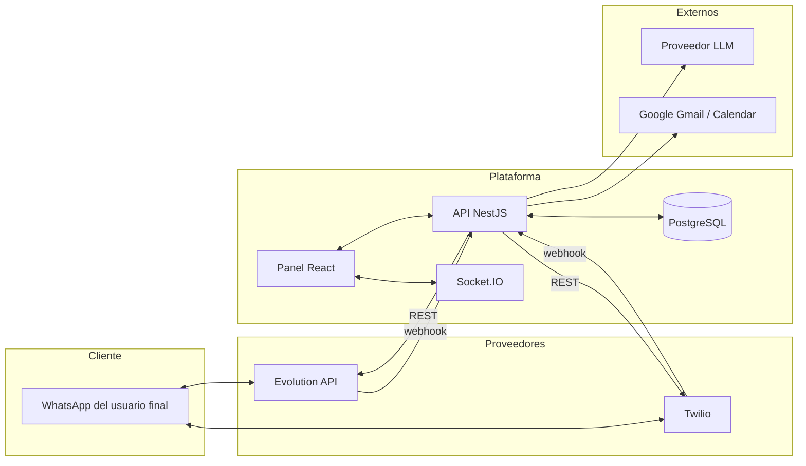
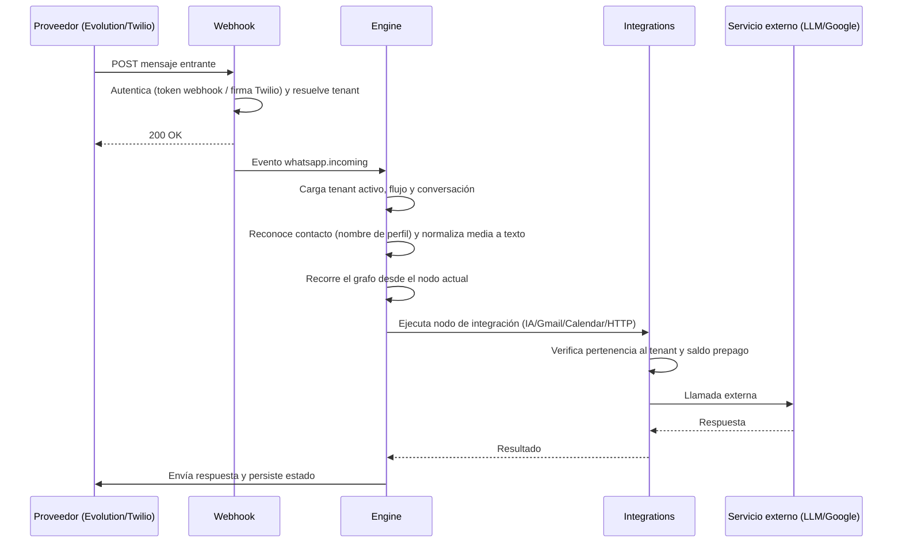
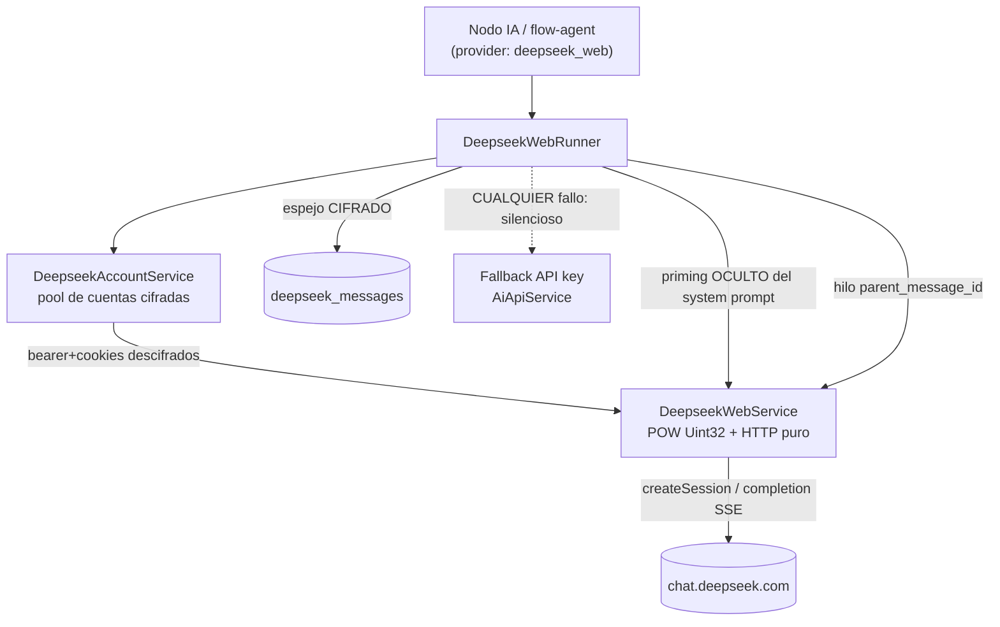
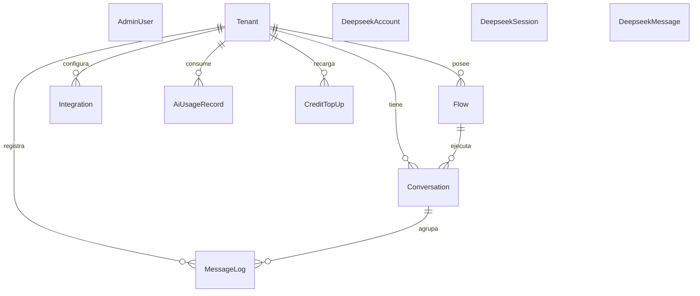
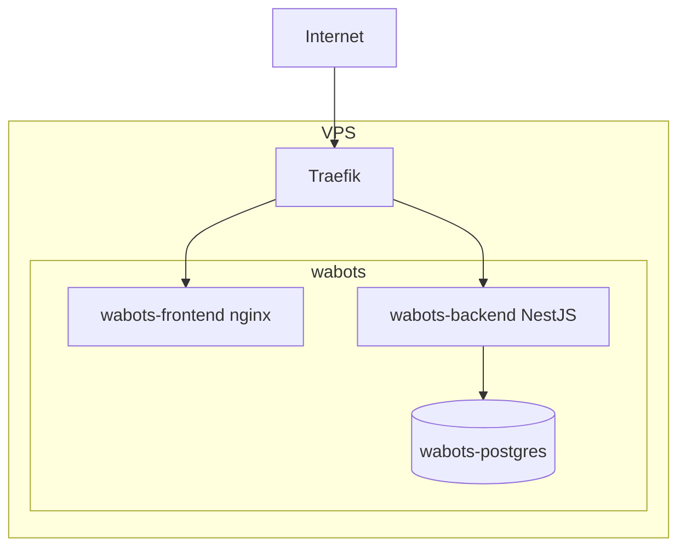

# Arquitectura

Plataforma multi-tenant para operar bots de WhatsApp mediante un editor visual de
flujos por nodos. Cada empresa cliente (tenant) se ejecuta de forma aislada sobre
su propio canal de mensajería, con integraciones y consumo de IA medidos por separado.

## Stack

| Capa | Tecnología |
|------|------------|
| Backend | NestJS 10 (TypeScript), monolito modular |
| ORM / BD | Prisma 5 · PostgreSQL |
| Frontend | React 18 · Vite · React Flow 11 · Zustand · TailwindCSS |
| Mensajería | Evolution API (por instancia) y Twilio (por número), seleccionable por tenant |
| Tiempo real | Socket.IO (estado de conexión y QR), autenticado por token |
| IA | Proveedores LLM intercambiables (OpenAI, Anthropic, DeepSeek, Google) |
| Media offline | Whisper (transcripción), Tesseract (OCR), NLLB (traducción) — sin costo de tokens |
| Google | OAuth2 (Gmail, Calendar) y Service Account (Calendar directo) |

## Componentes

## Módulos del backend

| Módulo | Responsabilidad |
|--------|-----------------|
| `auth` | Login del admin, tokens de acceso/refresco, sesión única por usuario, bloqueo por intentos, revocación |
| `tenants` | CRUD de empresas, encendido/apagado del servicio, canal de mensajería, borrado en cascada |
| `whatsapp` | Integración con Evolution y Twilio, webhooks entrantes, gateway Socket.IO autenticado |
| `flows` | CRUD y validación del grafo; cifrado de secretos del grafo en reposo |
| `engine` | Motor stateful que recorre el grafo por conversación y ejecuta cada nodo |
| `conversations` | Estado por contacto (nodo actual, variables), nombre de contacto, historial |
| `integrations` | Punto único de ejecución de IA, Gmail, Calendar y HTTP; cifrado de credenciales; control de saldo |
| `metering` | Registro de consumo de IA por tenant y saldo prepago |
| `email-agent` | Poller que lee correos, los clasifica y agenda citas |
| `logs` | Consulta de eventos del sistema y actividad de mensajes |
| `flow-agent` | Construcción de flujos a partir de lenguaje natural (NL → grafo) |
| `deepseek-web` | Proveedor de IA vía SESIÓN WEB de DeepSeek (sin API key), aislado, con fallback a API key |
| `common` | Prisma, cifrado (AES-256-GCM), guards, decoradores, filtros, seed del admin |

## Flujo de un mensaje entrante

Puntos clave del motor:
- **Serialización por contacto**: un mutex en memoria (`tenantId:contacto`) encola los
  mensajes del mismo contacto; distintos contactos avanzan en paralelo.
- **Media**: el nodo de IA normaliza audio (transcripción), imágenes (OCR) y anota
  video/documentos, todo offline. Texto y enlaces se usan tal cual.
- **Reconocimiento de contacto**: el nombre de perfil de WhatsApp se persiste en la
  conversación y se expone al flujo como variable para personalizar la atención.
- **Resiliencia**: los nodos de integración derivan por `onError`; las conversaciones
  inactivas se reinician por expiración; los errores no rompen el manejador de eventos.

## Proveedor DeepSeek-web (IA por sesión web, gratis)

Proveedor **alternativo** al de API key para AHORRAR costos: reutiliza la sesión web
de una cuenta DeepSeek (sin pagar tokens de API). Es un módulo **aislado**
(`deepseek-web`) que **no toca** `AiApiService` ni los proveedores oficiales; se
activa poniendo `provider: 'deepseek_web'` en la config del nodo, y la **API key
queda solo como fallback**. Sirve a los DOS consumidores de IA:

- **Modo agéntico** (nodo `aiAgent`): responde los chats de WhatsApp.
- **Modo builder** (`flow-agent`): programa flujos. Como el web no tiene
  function-calling, las FLOW_TOOLS se **emulan por prompt** (protocolo JSON) y se
  inyecta el catálogo COMPLETO de nodos.

Puntos clave:
- **Sesión por consumidor**: `chat:<conversación>` (agéntico) o `builder:<id>` (CLI);
  cada uno con su `chat_session` propio y contexto server-side en DeepSeek.
- **Inyección de contexto SEPARADA**: el system prompt del flujo se "hornea" como un
  turno de **priming OCULTO** (su respuesta se descarta, nunca se muestra); trae los
  guardrails anti-jailbreak/identidad (parity con el modo API).
- **Login solo local**: el `users/login` exige AWS WAF que no se resuelve headless →
  la sesión se captura en local y se sincroniza CIFRADA (bearer+cookies) a la BD del
  servidor con `scripts/seed-deepseek-account.mjs`; el server solo usa/rota, nunca
  guarda la contraseña. El chat en sí es HTTP puro (sin navegador por mensaje).
- **Resiliencia**: pool de cuentas con rotación; cifrado tolerante (cred no
  descifrable → fuera del pool); auto-sanado de sesión caída (recrea + re-prima +
  reintenta); y **fallback silencioso a API key** ante cualquier fallo (el usuario
  nunca ve un error). Solo modo instantáneo, sin thinking.

## Modelo de datos

- **AdminUser**: cuenta de administrador. Control de sesión (`sessionId`, `sessionUa`),
  revocación (`tokenVersion`) y bloqueo por intentos (`failedLoginAttempts`, `lockedUntil`).
- **Tenant**: empresa cliente. Estado (`ACTIVE`/`SUSPENDED`/`PENDING`), proveedor de
  canal, `activeFlowId` y secretos del canal cifrados.
- **Flow**: grafo `{ nodes, edges }`. Las credenciales por nodo se cifran en reposo.
- **Conversation**: nodo actual, variables y nombre del contacto (por teléfono).
- **Integration**: credenciales cifradas de IA, Gmail, Calendar o HTTP; por tenant o global.
- **AiUsageRecord / CreditTopUp**: consumo de IA y saldo prepago por tenant.
- **DeepseekAccount**: cuenta del pool DeepSeek-web; `bearerEnc`/`cookieEnc` cifrados,
  `status` (active/cooldown/failed/banned) para rotación. Vive SOLO en la BD (nunca en el repo).
- **DeepseekSession**: mapeo consumidor→`chat_session` de DeepSeek (`sessionKey`,
  `chatSessionId`, `currentMessageId` para el hilo, `systemPromptHash`, `accountId`).
- **DeepseekMessage**: espejo CIFRADO de la conversación web (`contentEnc`); `internal=true`
  marca el priming (oculto). Fuente propia además del historial en DeepSeek.

## Catálogo de nodos

| Categoría | Nodos |
|-----------|-------|
| Disparador | `trigger` |
| Mensajes | `sendText`, `interactiveMenu`, `sendFile` |
| Lógica | `captureInput`, `condition`, `delay`, `translateText` |
| Integraciones | `aiAgent`, `httpRequest`, `gmail`, `calendar` |
| Archivos | `receiveFile`, `transcribeAudio`, `ocrImage` |
| Fin | `handover`, `end` |

Reglas de conexión: `trigger` no tiene entrada; `end` y `handover` no tienen salida;
`condition` expone `true`/`false`; `interactiveMenu` una salida por opción; los nodos
de integración añaden una salida `onError`. El nodo `aiAgent` define su propio LLM
(proveedor, modelo y API key) o usa una integración de plataforma/empresa, opera en
modo conversacional con memoria y sale por intención (marcador configurable) para
enganchar sub-flujos determinísticos (captura de datos, validación, agendamiento).

## Seguridad

**Autenticación y sesión**
- Cuenta de administrador (sin registro público; siembra idempotente por variables).
- Access token de vida corta + refresh token con renovación deslizante.
- **Sesión única por usuario**, atada al dispositivo (User-Agent): iniciar sesión en
  otro equipo desconecta el anterior; un token copiado a otro dispositivo se rechaza.
- **Bloqueo por intentos**: tras N fallos, la cuenta se penaliza por tiempo (por usuario,
  no por IP), informando los segundos restantes en cada reintento.
- Revocación inmediata vía versión de token y sesión, verificadas en base de datos.

**Autorización y superficie**
- Guard JWT global (fail-closed); las rutas públicas (webhooks, callback OAuth) se
  marcan explícitamente. Guard de roles disponible por endpoint.
- Rate limiting global y por endpoint; confianza en el proxy inverso para la IP real.
- Helmet, CORS restringido por origen, validación estricta de entrada, límites de payload.

**Datos e integraciones**
- Secretos en reposo (API keys, tokens OAuth, credenciales de canal) cifrados con
  AES-256-GCM; nunca se devuelven en claro en las respuestas de la API.
- Aislamiento multi-tenant: las integraciones se validan por pertenencia al tenant;
  los webhooks resuelven el tenant por token (Evolution) o firma y número (Twilio).
- `state` de OAuth firmado con HMAC y con expiración (anti-CSRF/replay).
- El nodo HTTP bloquea destinos de red internos (protección anti-SSRF).
- El arranque aborta si faltan o son débiles los secretos obligatorios.

## Despliegue

Contenedores Docker Compose (`wabots-frontend`, `wabots-backend`, `wabots-postgres`)
tras Traefik. El backend aplica migraciones de Prisma al arrancar y siembra el admin
inicial de forma idempotente. Los modelos de IA offline persisten en un volumen.
